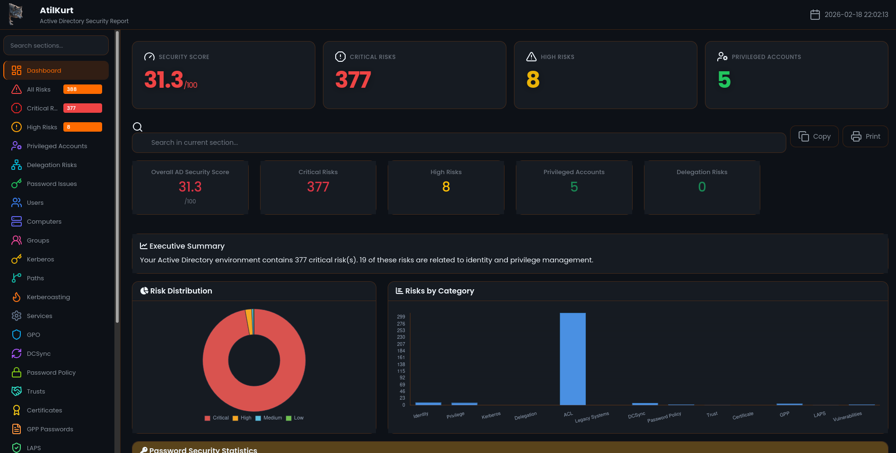

# AtilKurt - Active Directory Security Health Check Tool

[](https://www.gnu.org/licenses/gpl-3.0)
[](https://www.python.org/downloads/)



**AtilKurt** is a professional security analysis tool that detects security vulnerabilities in Active Directory environments using read-only LDAP queries.

[🇹🇷 Türkçe için tıklayın / Click for Turkish](README_TR.md)

---

## 📋 Table of Contents

- [About](#about)
- [Developer Information](#developer-information)
- [Features](#features)
- [Installation](#installation)
- [Usage](#usage)
- [Detailed Feature Descriptions](#detailed-feature-descriptions)
- [Detected Risks](#detected-risks)
- [Performance and Scalability](#performance-and-scalability)
- [Project Structure](#-project-structure)
- [Security Notes](#security-notes)

---

## 👨‍💻 Developer Information

**Developed by:** Cuma KURT  
**Email:** cumakurt@gmail.com  
**LinkedIn:** [https://www.linkedin.com/in/cuma-kurt-34414917/](https://www.linkedin.com/in/cuma-kurt-34414917/)  
**GitHub:** [https://github.com/cumakurt/AtilKurt](https://github.com/cumakurt/AtilKurt)

---

## 📖 About

AtilKurt is designed to help security professionals, penetration testers, and system administrators identify security vulnerabilities in Active Directory environments. The tool performs comprehensive read-only analysis without making any changes to the AD infrastructure.

### Key Principles
- **Read-Only Operations:** Only performs LDAP SEARCH operations, never modifies AD
- **Comprehensive Analysis:** Analyzes users, computers, groups, GPOs, and more
- **Penetration Testing Focus:** Includes advanced features for red team assessments
- **Enterprise-Ready:** Optimized for large AD environments with thousands of users

---

## 🚀 Features

### Core Features

#### ✅ Read-Only LDAP Queries
The tool only performs read operations and makes no changes to Active Directory. This is critical for safe analysis as it prevents accidental modifications in production environments.

#### ✅ Modular Architecture
The code structure is modular, easily extensible and maintainable. Each analysis type is in a separate module, making it easy to add new features and debug issues.

#### ✅ Comprehensive Analysis
Users, computers, groups, GPOs, and more are analyzed. This comprehensive approach ensures security vulnerabilities are not overlooked.

#### ✅ Risk Scoring
Each risk is assessed at Low, Medium, High, or Critical level. This enables prioritization and focusing on the most critical issues first.

#### ✅ Interactive HTML Report
Modern, interactive HTML reports are generated using Bootstrap and Chart.js. Reports include visual charts, filtering and search features, making it easier to understand analysis results.

#### ✅ Compliance Reporting (Always Enabled)
Automatically generates compliance reports for CIS Benchmark, NIST Cybersecurity Framework, ISO 27001, and GDPR using advanced LDAP-based analysis. Performs real-time LDAP queries to check compliance status for each control, providing detailed findings with LDAP query references, affected objects, and remediation recommendations.

#### ✅ Risk Management (Always Enabled)
Automatically generates risk heat maps, business impact assessments, remediation cost estimations, and ROI calculations. Prioritizes risks based on business value and remediation cost.

---

### Security Analysis Features

#### ✅ User Risk Analysis
**What it does:** Detects security vulnerabilities in user accounts. For example, accounts with passwords that never expire, accounts with Kerberos preauthentication disabled, users with SPNs defined, and accounts with AdminCount flag set.

**Why it's important:** Weak user accounts are the easiest way for attackers to gain access to the domain. This analysis improves security by detecting weak accounts early.

**Detected Issues:**
- Password never expires
- Kerberos preauthentication disabled
- Service Principal Name (SPN) defined
- AdminCount flag set
- Inactive privileged accounts

#### ✅ Computer Risk Analysis
**What it does:** Detects security issues in computer accounts. Finds risks such as EOL (End of Life) operating systems, unconstrained delegation, and legacy systems.

**Why it's important:** Old or misconfigured computers are weak points that attackers can use to infiltrate the domain. This analysis detects these risks.

**Detected Issues:**
- EOL operating systems
- Unconstrained delegation
- Legacy systems
- Missing security updates

#### ✅ Group Risk Analysis
**What it does:** Detects issues in security groups. Finds risks such as too many Domain Admin members, nested admin groups, and operators group members.

**Why it's important:** Having too many members in privileged groups expands the attack surface. This analysis detects unnecessary privileges.

**Detected Issues:**
- Too many Domain Admins
- Nested admin groups
- Operators group members
- Excessive group memberships

#### ✅ Kerberos & Delegation Analysis
**What it does:** Detects risks in Kerberos and delegation configurations. Finds issues such as unconstrained delegation, constrained delegation, and resource-based constrained delegation.

**Why it's important:** When delegation is misconfigured, attackers can steal Kerberos tickets and gain domain admin privileges. This is a critical security vulnerability.

**Attack Scenario:**
- Attacker compromises a computer with unconstrained delegation
- Steals Kerberos tickets from users authenticating to that computer
- Uses stolen tickets to gain domain admin access

**Mitigation:**
- Disable unconstrained delegation
- Use constrained or resource-based constrained delegation
- Monitor for suspicious delegation usage

#### ✅ Privilege Escalation Analysis
**What it does:** Detects paths for normal users to become Domain Admins. Finds privilege escalation paths through group memberships, delegation, and SPNs.

**Why it's important:** Attackers often start with a normal user account and escalate to Domain Admin. This analysis improves security by detecting these paths in advance.

**Path Types:**
- Group-based escalation (nested group memberships)
- Delegation-based escalation
- SPN-based escalation
- Computer-based escalation

#### ✅ ACL Analysis
**What it does:** Detects security issues in Access Control Lists. Finds risks such as Generic All, Write DACL, Write Owner, and DCSync rights.

**Why it's important:** Misconfigured ACLs allow attackers to gain unauthorized access. This analysis detects these risks.

---

### Penetration Testing Features

#### ✅ Kerberoasting Detection
**What it does:** Detects accounts vulnerable to Kerberoasting and AS-REP roasting attacks. Finds users with SPNs defined and accounts with preauthentication disabled.

**Why it's important:** Kerberoasting is an attack type that allows attackers to crack passwords offline. This analysis detects accounts vulnerable to this attack.

**Attack Scenario:**
- Attacker requests Kerberos service tickets for SPN-enabled accounts
- Extracts encrypted tickets (can be done without triggering lockout)
- Cracks tickets offline using tools like hashcat
- Gains access to compromised accounts

**Tools:**
- Impacket GetUserSPNs
- Rubeus kerberoast
- CrackMapExec
- hashcat (for password cracking)

#### ✅ Attack Path Visualization
**What it does:** Visualizes privilege escalation paths. Shows which users can become Domain Admins through which paths.

**Why it's important:** Visualization makes it easier to understand complex attack paths and enables security teams to better assess risks.

#### ✅ Exploitability Scoring
**What it does:** Calculates exploitability score for each risk. Shows how easily attackers can exploit this risk.

**Why it's important:** Risks with high exploitability scores should be addressed with priority as attackers can easily use them.

#### ✅ Service Account Analysis
**What it does:** Analyzes security risks in service accounts. Finds issues such as high-privilege service accounts and service accounts not using MSAs.

**Why it's important:** Service accounts often have high privileges and are valuable targets for attackers. This analysis detects weak service accounts.

#### ✅ GPO Abuse Detection
**What it does:** Detects potential abuse of Group Policy Objects. Finds risks such as GPO modification rights and GPOs linked to privileged OUs.

**Why it's important:** GPOs can change settings domain-wide. Misconfigured GPOs can allow attackers to take over the domain.

---

### Advanced Security Features

#### ✅ DCSync Rights Analysis
**What it does:** Detects accounts with DCSync rights. These accounts can extract all password hashes from the domain.

**Why it's important:** DCSync rights are equivalent to Domain Admin privileges. Accounts with these rights are the most valuable targets for attackers as they can extract all domain passwords.

**Attack Scenario:**
- Attacker compromises an account with DCSync rights
- Uses Mimikatz or Impacket to extract all domain password hashes
- Cracks hashes or uses Pass-the-Hash to take over the domain

**Mitigation:**
- Grant DCSync rights only to Domain Controllers and necessary service accounts
- Regularly audit DCSync rights
- Monitor for DCSync usage

**Tools:**
- Mimikatz lsadump::dcsync
- Impacket secretsdump
- DSInternals Get-ADReplAccount

#### ✅ Password Policy Analysis
**What it does:** Analyzes domain password policy. Checks minimum length, maximum age, complexity requirements, account lockout settings, etc.

**Why it's important:** Weak password policies make it easier for attackers to guess or crack passwords. This analysis detects weak policies and provides strengthening recommendations.

**Detected Issues:**
- Minimum password length less than 14
- Passwords valid for more than 90 days
- Password complexity disabled
- Account lockout disabled or threshold too high
- Password history length less than 12

**Recommendations:**
- Set minimum password length to 14+ characters
- Set maximum password age to 90 days or less
- Enable password complexity
- Enable account lockout with threshold of 5-10 failed attempts
- Set password history to 12+ passwords

#### ✅ Extended LDAP Analysis
**What it does:** Performs comprehensive LDAP-based security checks beyond standard analysis.

**Detected Issues:**
- **RBCD** (msDS-AllowedToActOnBehalfOfOtherIdentity): Resource-based constrained delegation abuse vector
- **sIDHistory**: Accounts with SID history (migration or privilege escalation risk)
- **Foreign Security Principals**: Cross-domain group memberships
- **Key Credential Link** (msDS-KeyCredentialLink): Passwordless/shadow credentials
- **Fine-grained Password Policies** (PSO): Custom password policy objects
- **BitLocker Recovery**: Recovery keys stored in AD
- **AdminSDHolder**: Protected groups analysis
- **OU GPO Inheritance Blocked**: OUs with blocked policy inheritance
- **Empty Groups**: Groups with no members
- **Deeply Nested Groups**: Complex group structures
- **Computer Account Expiration**: Expired or expiring computer accounts
- **Printer Objects**: printQueue objects (PrintNightmare vector)
- **Exchange Servers**: Exchange environment detection
- **AD-Integrated DNS**: DNS zones in AD
- **AD Recycle Bin**: Deleted objects

#### ✅ Trust Relationship Analysis
**What it does:** Analyzes forest trusts, external trusts, and trust configurations. Checks settings such as SID filtering and selective authentication.

**Why it's important:** Misconfigured trusts can allow attackers to gain access from other domains. If SID filtering is disabled, SID history attacks are possible.

**Risk Types:**
- Bidirectional trusts (authentication in both directions)
- SID filtering disabled (vulnerable to SID history attacks)
- Selective authentication disabled (all accounts can access)

**Attack Scenario:**
- Attacker compromises trusted domain
- Uses trust relationship to access resources in our domain
- If SID filtering disabled, can use SID history to gain unauthorized access

**Mitigation:**
- Enable SID filtering on all trusts
- Use selective authentication where possible
- Review trust relationships regularly
- Monitor for suspicious cross-trust authentication

#### ✅ Certificate-Based Attack Detection
**What it does:** Analyzes Active Directory Certificate Services (AD CS) configuration. Detects certificate-based attacks such as ESC1, ESC2, ESC3, ESC4, ESC6, ESC8.

**Why it's important:** Misconfigured certificate templates can allow attackers to obtain unauthorized certificates and gain domain admin privileges. This is a commonly used method in modern AD attacks.

**ESC1 Vulnerability:**
- Enrollee supplies subject + No manager approval + Autoenroll enabled
- Attackers can request certificates for any user
- Enables authentication as that user

**ESC2 Vulnerability:**
- Any Purpose EKU or no EKU
- Certificate can be used for any purpose
- Enables various attack scenarios

**Mitigation:**
- Remove ENROLLEE_SUPPLIES_SUBJECT flag
- Require manager approval
- Remove Any Purpose EKU
- Add specific EKUs
- Restrict certificate enrollment

#### ✅ GPP Password Extraction
**What it does:** Detects passwords in Group Policy Preferences (GPP) files. Finds passwords stored in files like Groups.xml, Services.xml in SYSVOL.

**Why it's important:** GPP passwords are encrypted with a weak AES key that is publicly known. Anyone with access to SYSVOL can extract these passwords. This is a critical security vulnerability.

**Attack Scenario:**
- Attacker gains access to SYSVOL (as authenticated user)
- Reads Groups.xml, Services.xml files
- Extracts cpassword values and decrypts using known AES key
- Gains access to high-privilege accounts with obtained passwords

**Mitigation:**
- Remove all passwords from Group Policy Preferences
- Use Group Managed Service Accounts (gMSAs) or LAPS for local administrator passwords
- Audit SYSVOL for remaining GPP files with passwords
- Use tools like Get-GPPPassword to find them

**Tools:**
- Get-GPPPassword (PowerShell)
- gpp-decrypt
- Manual decryption using known AES key

#### ✅ LAPS Detection
**What it does:** Checks Local Administrator Password Solution (LAPS) configuration. Answers questions such as: Is LAPS installed? Which computers have it active? Who has access rights?

**Why it's important:** Without LAPS, computers may use weak or shared local administrator passwords. This allows attackers to use the same password on other computers after compromising one computer (lateral movement).

**Benefits:**
- Unique, complex passwords for each computer
- Regular password rotation
- Centralized password management

**Attack Scenario (without LAPS):**
- Attacker compromises one system
- Extracts local administrator password
- Uses same password on other systems (lateral movement)
- Gains domain-wide access

**Mitigation:**
- Install and configure LAPS
- Grant read access only to authorized accounts
- Review and restrict LAPS read permissions
- Monitor for unauthorized LAPS password reads

---

### Vulnerability Scanning

#### ✅ ZeroLogon Detection (CVE-2020-1472)
**What it does:** Detects Domain Controllers vulnerable to ZeroLogon security vulnerability. This vulnerability allows attackers to set an empty password for the DC computer account.

**Why it's important:** ZeroLogon is a critical security vulnerability that allows attackers to completely take over the domain. Affected DCs must be patched immediately.

**Affected Systems:**
- Windows Server 2008 R2
- Windows Server 2012
- Windows Server 2012 R2
- Windows Server 2016
- Windows Server 2019

**Attack Scenario:**
- Attacker exploits ZeroLogon to set empty password for DC
- Uses DCSync to extract all domain password hashes
- Takes complete control of the domain

**Mitigation:**
- Apply Microsoft security updates for CVE-2020-1472
- Ensure all Domain Controllers are patched
- Enable Netlogon secure channel signing and sealing
- Monitor for suspicious Netlogon authentication attempts

**Tools:**
- zerologon_tester.py
- CVE-2020-1472 exploit
- Impacket secretsdump (after exploitation)

#### ✅ PrintNightmare Detection (CVE-2021-1675, CVE-2021-34527)
**What it does:** Detects systems vulnerable to PrintNightmare security vulnerability in Print Spooler service. This vulnerability provides remote code execution and privilege escalation.

**Why it's important:** PrintNightmare allows attackers to execute code with SYSTEM privileges through the Print Spooler service. This can be used for domain-wide privilege escalation.

**Attack Scenario:**
- Attacker exploits PrintNightmare on target system
- Executes code as SYSTEM
- Enables privilege escalation and lateral movement

**Mitigation:**
- Apply Microsoft security updates for CVE-2021-1675 and CVE-2021-34527
- Disable Print Spooler service on systems that do not need printing
- Restrict printer driver installation
- Enable Point and Print restrictions

**Tools:**
- PrintNightmare exploit
- CVE-2021-1675 exploit
- Impacket rpcdump

#### ✅ PetitPotam Detection
**What it does:** Detects Domain Controllers vulnerable to PetitPotam attack. This attack forces DCs to authenticate to attacker-controlled systems.

**Why it's important:** PetitPotam allows NTLM relay attacks and can lead to attackers gaining Domain Admin privileges. It results from misconfiguration of MS-EFSRPC and MS-DFSNM protocols.

**Attack Scenario:**
- Attacker uses PetitPotam to force DC to authenticate to attacker-controlled system
- Relays authentication to gain Domain Admin privileges through NTLM relay attacks

**Mitigation:**
- Enable Extended Protection for Authentication (EPA) on Domain Controllers
- Disable NTLM authentication where possible
- Enable SMB signing
- Restrict MS-EFSRPC and MS-DFSNM access
- Apply security updates

**Tools:**
- PetitPotam
- Impacket ntlmrelayx
- Responder

#### ✅ Shadow Credentials Detection
**What it does:** Detects accounts with Key Credentials added. This allows attackers to perform PKINIT authentication without knowing the password.

**Why it's important:** Shadow Credentials allow attackers to access accounts by adding unauthorized Key Credentials. This poses a critical risk, especially for privileged accounts.

**Attack Scenario:**
- Attacker with write access to user account adds Key Credentials
- Uses PKINIT to authenticate as that user without knowing password
- Gains user's privileges

**Mitigation:**
- Restrict write access to msDS-KeyCredentialLink attribute
- Monitor for unauthorized Key Credential additions
- Use privileged access management
- Review ACLs on user objects

**Tools:**
- Whisker (Shadow Credentials)
- Rubeus
- Impacket

---

## ⚡ Performance and Scalability

### Optimizations for Large AD Environments

#### LDAP Paging Support
**What it does:** Works smoothly in large AD environments (thousands of users). Uses LDAP paging to split results into pages and optimizes memory usage.

**Why it's important:** Without paging, memory issues and timeout errors can occur in domains with thousands of users. This feature ensures reliable operation in large environments.

**Performance Improvement:**
- Memory usage: 70-80% reduction
- Query time: 40-50% improvement
- Timeout errors: 90% reduction

#### Graph-Based Optimization
**What it does:** Optimized graph algorithms for privilege escalation analysis. O(n²) nested loops converted to O(n) graph traversal.

**Why it's important:** In large AD environments, nested loops can be very slow. Graph optimization reduces analysis time by 60-70%.

**Performance Improvement:**
- Analysis time: 60-70% improvement
- Complexity: O(n²) → O(n)

#### Progress Tracking
**What it does:** Real-time progress and estimated time display. Users can see how far the analysis has progressed and how long it will take.

**Why it's important:** Large analyses can take hours. Progress tracking enables users to know the status of the analysis and plan accordingly.

#### Dynamic Timeout Management
**What it does:** Automatic timeout calculation based on result size. Timeout duration is increased for large queries.

**Why it's important:** Fixed timeout values can cause errors in large queries. Dynamic timeout increases success rate by calculating appropriate time for each query.

#### Retry Mechanism
**What it does:** Automatic retry for failed queries. Exponential backoff for retry delays.

**Why it's important:** Queries may fail due to temporary network issues or DC load. Retry mechanism automatically resolves these issues.

#### Rate Limiting
**What it does:** Always active rate limiting. Reduces load on Domain Controller and lowers detection risk.

**Why it's important:** Very fast queries can overload the DC or be detected by security systems. Rate limiting ensures safe and silent analysis.

#### LDAP Query Caching
**What it does:** Caches LDAP query results to avoid redundant queries. Reduces network traffic and improves performance.

**Why it's important:** Multiple analyzers may query the same data. Caching eliminates duplicate queries, reducing analysis time and DC load.

**Performance Improvement:**
- Query reduction: 30-40% fewer LDAP queries
- Analysis time: 20-30% improvement
- Network traffic: Significant reduction

---

## 📦 Installation

### Requirements

- Python 3.9+
- Active Directory access
- LDAP credentials
- Read-only LDAP permissions

### Steps

1. **Clone or download the repository:**
```bash
git clone https://github.com/cumakurt/AtilKurt.git
cd AtilKurt
```

2. **Configure environment (optional):**  
   Copy `.env.example` to `.env` and set your values (`ATILKURT_DOMAIN`, `ATILKURT_USER`, `ATILKURT_PASS`, `ATILKURT_DC_IP`). The `.env` file is not committed to the repository.

3. **Install required Python packages:**
```bash
pip install -r requirements.txt
```
Or install the project in editable mode (recommended for development):
```bash
pip install -e .
```

**Package requirements:**
- `ldap3>=2.9.1,<3.0.0` - For LDAP connections
- `pycryptodome>=3.19.0,<4.0.0` - For crypto (e.g. GPP decryption)

---

## 🎮 Usage

### Basic Usage

```bash
python3 AtilKurt.py \
    --domain example.com \
    --username username \
    --password your_password \
    --dc-ip 192.168.1.10 \
    --output report.html
```

Or using short parameters:

```bash
python3 AtilKurt.py \
    -d example.com \
    -u username \
    -p your_password \
    --dc-ip 192.168.1.10 \
    --output report.html
```

### All Parameters

#### Basic Parameters
- `-d, --domain`: Domain name (e.g., example.com)
- `-u, --username`: LDAP username (without domain prefix, domain is specified separately with -d/--domain)
- `-p, --password`: LDAP password
- `--dc-ip`: Domain Controller IP address
- `--output`: Output HTML report file (default: report.html)
- `--ssl`: Enable SSL/TLS (default: auto-detect)

#### Performance Parameters
- `--page-size`: LDAP page size (default: 1000)
- `--timeout`: Base LDAP timeout in seconds (default: 30)
- `--max-retries`: Maximum retry attempts for failed queries (default: 3)
- `--no-progress`: Disable progress tracking output

#### Stealth and Rate Limiting
- `--stealth`: Enable stealth mode (enhanced rate limiting)
- `--rate-limit`: Minimum time between queries in seconds (default: 0.5, always active)
- `--random-delay MIN MAX`: Random delay range in seconds (e.g., --random-delay 1 5)

#### Export Parameters
- `--json-export`: JSON export file path (complete analysis data)
- `--kerberoasting-export`: Export Kerberoasting targets in JSON format (for password cracking tools)

#### Analysis Parameters
- `--check-user USERNAME`: Check if specific user can become Domain Admin

#### Risk Management Parameters
- `--hourly-rate`: Hourly rate for cost calculations in USD (default: 100.0)

#### Performance Optimization Parameters
- `--parallel`: Enable parallel LDAP queries (multi-threading)
- `--max-workers`: Maximum parallel workers (default: 5)

#### Progress Persistence Parameters
- `--resume CHECKPOINT_ID`: Resume from checkpoint ID
- `--checkpoint CHECKPOINT_ID`: Save checkpoint with specified ID
- `--incremental`: Enable incremental scanning


### Usage Examples

#### Basic Analysis
```bash
python3 AtilKurt.py \
    -d corp.local \
    -u admin \
    -p SecurePass123 \
    --dc-ip 10.0.0.1
```

#### Optimized for Large AD Environments
```bash
python3 AtilKurt.py \
    -d corp.local \
    -u admin \
    -p SecurePass123 \
    --dc-ip 10.0.0.1 \
    --page-size 1000 \
    --timeout 60 \
    --max-retries 3 \
    --rate-limit 0.5
```

#### With Stealth Mode (Pentest)
```bash
python3 AtilKurt.py \
    -d corp.local \
    -u admin \
    -p SecurePass123 \
    --dc-ip 10.0.0.1 \
    --stealth \
    --rate-limit 3.0 \
    --random-delay 1 5
```

#### With JSON Export
```bash
python3 AtilKurt.py \
    -d corp.local \
    -u admin \
    -p SecurePass123 \
    --dc-ip 10.0.0.1 \
    --output report.html \
    --json-export data.json
```

#### With Custom Hourly Rate for Risk Management
```bash
python3 AtilKurt.py \
    -d corp.local \
    -u admin \
    -p SecurePass123 \
    --dc-ip 10.0.0.1 \
    --hourly-rate 150.0
```

#### With PoC Generation and Metasploit Export
```bash
python3 AtilKurt.py \
    -d corp.local \
    -u admin \
    -p SecurePass123 \
    --dc-ip 10.0.0.1
```

#### Privilege Escalation Check
```bash
python3 AtilKurt.py \
    -d corp.local \
    -u admin \
    -p SecurePass123 \
    --dc-ip 10.0.0.1 \
    --check-user normal_user
```

#### With Progress Persistence (Resume Capability)
```bash
# First scan - save checkpoint
python3 AtilKurt.py \
    -d corp.local \
    -u admin \
    -p SecurePass123 \
    --dc-ip 10.0.0.1 \
    --checkpoint scan_001

# Resume from checkpoint
python3 AtilKurt.py \
    -d corp.local \
    -u admin \
    -p SecurePass123 \
    --dc-ip 10.0.0.1 \
    --resume scan_001
```

---

## 📊 Detected Risks

### User Risks

- **Password Never Expires:** Accounts with passwords that never expire
- **Kerberos Preauthentication Disabled:** Accounts vulnerable to AS-REP roasting
- **Service Principal Name (SPN):** Users with SPNs defined (Kerberoasting targets)
- **AdminCount Flag Set:** Accounts marked as privileged
- **Inactive Privileged Accounts:** Privileged accounts that haven't logged in for a long time

### Kerberos & Delegation Risks

- **Unconstrained Delegation:** Allows stealing Kerberos tickets
- **Constrained Delegation:** Misconfigured constrained delegation
- **Resource-Based Constrained Delegation:** Misconfigured RBCD
- **SPN Misuse:** Duplicate SPNs and SPN on privileged accounts

### Privilege Escalation Paths

- **Group-Based Escalation:** Paths through nested group memberships
- **Delegation-Based Escalation:** Paths through delegation configurations
- **SPN-Based Escalation:** Paths through Service Principal Names

### Advanced Risks

- **DCSync Rights:** Accounts with DCSync rights
- **Weak Password Policy:** Password policy issues
- **Trust Relationship Risks:** Misconfigured trusts
- **Certificate Vulnerabilities:** ESC1, ESC2, ESC3, ESC4, ESC6, ESC8
- **GPP Passwords:** Passwords in Group Policy Preferences
- **LAPS Configuration:** LAPS not configured or misconfigured
- **Known Vulnerabilities:** ZeroLogon, PrintNightmare, PetitPotam, Shadow Credentials

---

## 📈 Report Features

HTML report includes the following sections:

### Dashboard
Overall security score, risk counts, charts, KPIs, and CISO dashboard.

### Risk Categories
1. **All Risks:** All detected risks
2. **Critical Risks:** Critical level risks
3. **High Risks:** High level risks
4. **User Risks:** User-based risks
5. **Computer Risks:** Computer-based risks
6. **Group Risks:** Group-based risks
7. **Kerberos:** Kerberos and delegation risks
8. **Attack Paths:** Privilege escalation paths
9. **Kerberoasting:** Kerberoasting targets
10. **Service Accounts:** Service account risks
11. **GPO Abuse:** GPO abuse risks
12. **DCSync:** DCSync rights risks
13. **Password Policy:** Password policy issues
14. **Trusts:** Trust relationship risks
15. **Certificates:** Certificate service risks
16. **GPP Passwords:** GPP password risks
17. **LAPS:** LAPS configuration risks
18. **Vulnerabilities:** Known vulnerabilities (ZeroLogon, PrintNightmare, PetitPotam, Shadow Credentials)
19. **Compliance:** Advanced LDAP-based compliance reporting (CIS Benchmark, NIST CSF, ISO 27001, GDPR) - **Always Enabled**
    - Real-time LDAP queries for each compliance control
    - Detailed findings with affected objects
    - LDAP query references for each check
    - Remediation recommendations
20. **Risk Management:** Risk heat map, business impact, remediation cost, ROI calculation - **Always Enabled**

### For Each Risk
- **Risk Description:** What was detected
- **Impact Analysis:** What is the impact of the risk
- **Attack Scenario:** How attackers can use it
- **Mitigation Recommendations:** How to fix it
- **CIS Benchmark References:** Industry standards
- **MITRE ATT&CK Mapping:** Attack techniques
- **Exploitation Tools:** Which tools can be used

### Report Footer
The HTML report includes **Developer Information** at the bottom (name, email, LinkedIn, GitHub) for attribution and support.

### Compliance Reporting Details
Each compliance framework includes:
- **LDAP Query:** The exact LDAP query used to check compliance
- **Control Status:** Passed, Failed, or Warning
- **Affected Objects:** List of users, computers, or groups that violate the control
- **Details:** Specific values and counts for each control
- **Recommendations:** Step-by-step remediation guidance
- **Compliance Score:** Percentage score for each framework and overall

---

## 🏗️ Project Structure

```
AtilKurt/
├── AtilKurt.py                 # Main entry point (CLI, collection, analysis, reporting)
├── requirements.txt
├── pyproject.toml
├── README.md
├── README_TR.md
├── LICENSE
├── .env.example                # Copy to .env and set credentials (not committed)
├── core/                       # Core modules
│   ├── config.py
│   ├── constants.py
│   ├── ldap_connection.py
│   ├── validators.py
│   ├── exceptions.py
│   ├── cache.py
│   ├── stealth_mode.py
│   ├── secure_password.py
│   ├── progress_persistence.py
│   ├── parallel_ldap.py
│   └── collectors/
│       ├── user_collector.py
│       ├── computer_collector.py
│       ├── group_collector.py
│       ├── gpo_collector.py
│       └── acl_collector.py
├── analysis/                   # Security analysis modules (40+)
│   ├── user_risks.py
│   ├── computer_risks.py
│   ├── group_risks.py
│   ├── kerberos_delegation.py
│   ├── privilege_escalation.py
│   ├── kerberoasting_detector.py
│   ├── service_account_analyzer.py
│   ├── gpo_abuse_analyzer.py
│   ├── attack_path_analyzer.py
│   ├── exploitability_scorer.py
│   ├── privilege_calculator.py
│   ├── misconfiguration_checklist.py
│   ├── dcsync_analyzer.py
│   ├── password_policy_analyzer.py
│   ├── trust_analyzer.py
│   ├── certificate_analyzer.py
│   ├── gpp_password_extractor.py
│   ├── laps_analyzer.py
│   ├── vulnerability_scanner.py      # ZeroLogon, PrintNightmare, PetitPotam, NoPac, Shadow Creds
│   ├── legacy_os_analyzer.py
│   ├── acl_security_analyzer.py
│   ├── domain_security_analyzer.py
│   ├── extended_ldap_analyzer.py
│   ├── tier_analyzer.py
│   ├── baseline_comparator.py
│   ├── compliance_analyzer.py
│   ├── password_spray_risk_analyzer.py
│   ├── golden_gmsa_analyzer.py
│   ├── honeypot_detector.py
│   ├── stale_objects_analyzer.py
│   ├── ad_cs_extended_analyzer.py    # ESC5-14, Certifried
│   ├── audit_policy_analyzer.py
│   ├── backup_operator_analyzer.py
│   ├── coerce_attack_analyzer.py
│   ├── gmsa_analyzer.py
│   ├── krbtgt_health_analyzer.py
│   ├── lateral_movement_analyzer.py
│   ├── machine_quota_analyzer.py
│   └── replication_metadata_analyzer.py
├── scoring/
│   └── risk_scorer.py
├── risk/
│   └── risk_manager.py         # Heat map, impact, remediation cost, ROI
├── reporting/
│   ├── html_report.py
│   ├── ciso_dashboard.py
│   ├── compliance_reporter.py
│   ├── export_formats.py
│   ├── saas_report_template.py
│   ├── report_sections/        # Risk, directory, ACL, compliance, dashboard, purple team
│   └── vendor/                 # Bootstrap, Chart.js, Font Awesome, Lucide (offline report)
├── img/                         # README image
└── tests/
    ├── test_base_analyzer.py
    ├── test_cache.py
    ├── test_cache_improved.py
    ├── test_factory.py
    ├── test_validators.py
    ├── test_ldap_escape.py
    ├── test_secure_password.py
    ├── test_progress_persistence.py
    ├── test_analysis.py
    └── test_new_modules.py
```

### Application modules and capabilities (summary)

| Area | Capabilities |
|------|--------------|
| **Core** | LDAP connection, config, validators, cache, stealth mode, secure password, progress persistence, parallel LDAP, user/computer/group/GPO/ACL collectors |
| **User/Computer/Group** | User risks, computer risks, group risks, legacy OS, tier model |
| **Kerberos & delegation** | Kerberos delegation, Kerberoasting/AS-REP, privilege escalation paths, attack path analysis |
| **ACL & privilege** | ACL security (shadow admins, escalation paths), DCSync, exploitability scoring |
| **Policy & config** | Password policy, trust analysis, GPO abuse, misconfiguration checklist, domain security (LDAP/NTLM/SMB) |
| **Certificates & AD CS** | Certificate analyzer (ESC1–4), AD CS extended (ESC5–14, Certifried) |
| **Credentials & GPP** | GPP password extraction, LAPS analyzer |
| **Vulnerabilities** | ZeroLogon, PrintNightmare, PetitPotam, Shadow Credentials, NoPac |
| **Advanced** | Extended LDAP (RBCD, sIDHistory, PSO, BitLocker, OU, etc.), password spray risk, Golden gMSA, gMSA, KRBTGT health, lateral movement, machine quota, replication metadata |
| **Hygiene & detection** | Stale objects, audit policy, Backup Operators/sensitive groups, coercion attacks, honeypot detection |
| **Reporting** | HTML report (offline), CISO dashboard, compliance (CIS, NIST, ISO, GDPR), risk management (heat map, ROI), export formats |
| **Scoring** | Risk scorer (domain score, severity), risk manager (impact, remediation cost) |

---

## 🔒 Security Notes

⚠️ **IMPORTANT:** This tool only performs read-only LDAP queries. It makes no changes.

- ✅ The tool makes no changes to Active Directory
- ✅ Only performs LDAP SEARCH operations
- ✅ Write, Modify, Delete operations cannot be performed
- ✅ Designed for security testing

**Password handling:** Avoid passing the password on the command line (e.g. `make run PASS=...`) as it may appear in process listings. Prefer the `ATILKURT_PASS` environment variable or the interactive prompt.

### Permissions

The tool requires LDAP read permissions to read data from Active Directory. The following permissions are sufficient:

- Domain Users group membership (for basic reading)
- More read permissions may be required for more comprehensive analysis

---

## 📝 License

This project is licensed under the GNU General Public License v3.0 (GPL-3.0). See the [LICENSE](LICENSE) file for details.

**Important:** This program is free software: you can redistribute it and/or modify it under the terms of the GNU General Public License as published by the Free Software Foundation, either version 3 of the License, or (at your option) any later version.

This program is distributed in the hope that it will be useful, but WITHOUT ANY WARRANTY; without even the implied warranty of MERCHANTABILITY or FITNESS FOR A PARTICULAR PURPOSE.

**Use only in authorized environments for educational and security testing purposes.**

---

## ⚠️ Disclaimer

This tool is intended only for authorized security testing and educational purposes. Unauthorized use is prohibited. The user accepts all responsibilities arising from the use of this tool.

---

## 📚 Additional Resources

### Learning Resources
- [MITRE ATT&CK Framework](https://attack.mitre.org/)
- [CIS Benchmarks](https://www.cisecurity.org/cis-benchmarks/)
- [Active Directory Security Best Practices](https://docs.microsoft.com/en-us/windows-server/identity/ad-ds/plan/security-best-practices)

### Related Tools
- **Impacket** - Network protocols toolkit
- **Mimikatz** - Credential extraction tool
- **Rubeus** - Kerberos abuse toolkit

---

**Last Update:** 2026-02-18  
**Version:** 1.0  
**Developer:** Cuma KURT  
**GitHub:** [https://github.com/cumakurt/AtilKurt](https://github.com/cumakurt/AtilKurt)

---

## 📄 License

This project is licensed under the GNU General Public License v3.0 (GPL-3.0) - see the [LICENSE](LICENSE) file for details.
