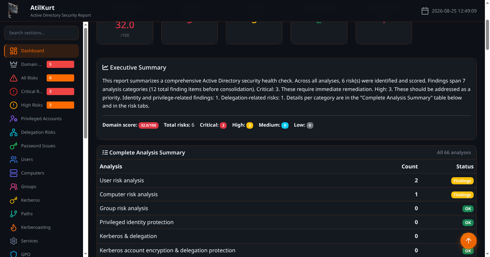
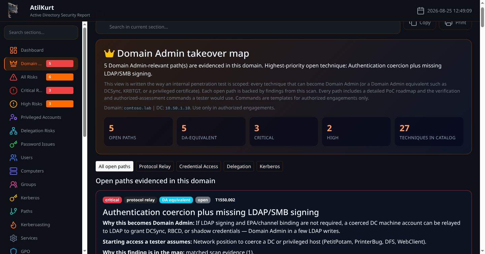
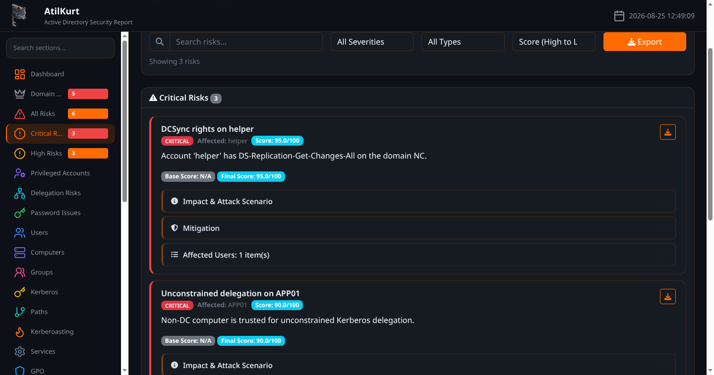
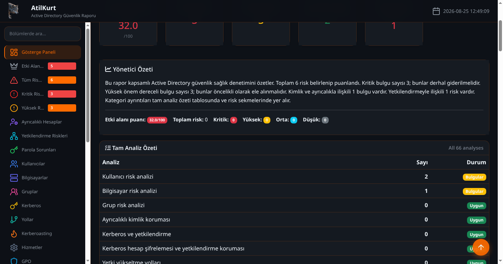
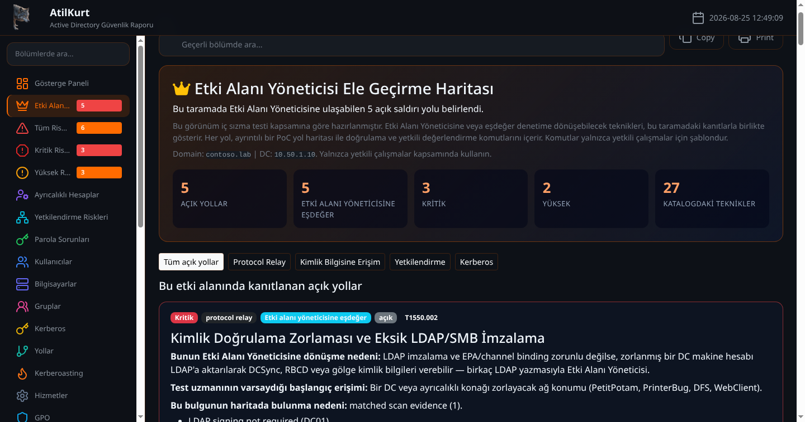
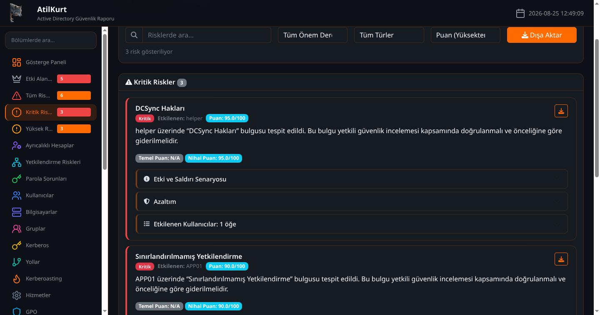

# AtilKurt

[](https://www.gnu.org/licenses/gpl-3.0)
[](https://www.python.org/downloads/)

AtilKurt is a read-only Active Directory security assessment tool. It collects directory data through LDAP, runs a broad set of security analyzers, scores the findings, and generates a self-contained HTML report for offline review. Reports are generated in English by default and can be fully localized to Turkish with `--lan tr`.

## Simplest Manual Usage

After completing either installation method below, a scan needs only the domain, username, and password. If `--dc-ip` is omitted, AtilKurt connects using the domain name:

```bash
ATILKURT_PASS='your-password' \
.venv/bin/atilkurt --domain example.com --username auditor
```

Replace the example values with the assessment account details. The password is passed through the environment instead of a command-line argument, so it is not exposed in the process argument list. If the domain name does not resolve to a reachable domain controller, add `--dc-ip 192.168.1.10`. Add `--ssl` when the domain controller provides LDAPS on port 636.

To generate the same assessment with a Turkish report, add `--lan tr`:

```bash
ATILKURT_PASS='your-password' \
.venv/bin/atilkurt --domain example.com --username auditor --lan tr
```

## Overview

The tool is designed for security assessments, internal red-team style reviews, and directory hygiene analysis. It does not modify Active Directory and is built around LDAP search operations only.

Core goals:

- Collect identity, group, computer, GPO, and ACL data from Active Directory
- Detect misconfigurations, weak controls, and known attack paths
- Correlate optional offline Windows events and exported DC/GPO posture evidence with LDAP findings
- Consolidate findings into a severity-based risk model
- Produce offline-capable English or Turkish HTML reports, JSON/OpenGraph exports, and optional checkpoints
- Support large environments with paging, caching, parallel collection, and incremental execution

## Screenshots

The following images are taken from a **synthetic demo dataset** (`contoso.lab`), not a live domain. They show the self-contained HTML report in English and Turkish. Regenerate them with:

```bash
python3 scripts/generate_demo_screenshots.py
```

### English report

**Dashboard** — domain score, severity KPIs, and executive summary:



**Domain Admin Map** — open takeover paths with PoC roadmap and usable commands:



**Critical Risks** — scored critical findings with impact and mitigation accordions:



### Turkish report (`--lan tr`)

**Gösterge Paneli** — same dashboard chrome localized to Turkish:



**Etki Alanı Yöneticisi Haritası** — PoC yol haritası and command labels in Turkish (command bodies stay paste-ready in English):



**Kritik Riskler** — localized finding titles and UI:



## Key Capabilities

### Directory Inventory

- User, computer, group, and GPO collection
- Object SID collection for identity and ACL correlation
- Large-domain friendly paging and query caching

### Security Analysis

- User, computer, and group risk analysis
- Kerberos delegation, account-level encryption compatibility, privileged-account delegation protection, privilege escalation, and ACL review
- Kerberoasting, AS-REP roasting, DCSync, GPP, LAPS, trust, and password policy checks
- AD CS analysis, including extended certificate abuse paths
- Authentication Policy/Silo, KeyCredentialLink forensics, strong certificate mapping, Windows LAPS v2, RC4 retirement, and AdminSDHolder drift checks
- gMSA-reader, AD CS control-plane, trust, AD-integrated DNS, and hybrid-identity relationship graphs
- Evidence-based Tier-0 shortest paths, chokepoints, and blast-radius analysis
- Extended LDAP checks for common privileged-object and configuration weaknesses
- Domain security, audit policy, stale object, gMSA, KRBTGT, machine quota, and replication metadata analysis

### Scoring and Prioritization

- Severity-based domain score
- Exploitability scoring
- Per-finding confidence scoring with a transparent evidence chain
- Risk prioritization and remediation cost estimation
- Business impact and ROI-style remediation views

### Reporting

- Single-file HTML report with embedded assets
- English reporting by default and complete Turkish report localization with `--lan tr`
- Domain Admin takeover map for pentest-oriented path review
- Optional BloodHound OpenGraph-shaped Tier-0 graph export
- JSON export for downstream processing
- Compliance reporting for CIS, NIST CSF, ISO 27001, and GDPR
- Executive summary and analysis summary tables
- Offline use without a separate `vendor/` directory

## How a Scan Works

AtilKurt follows a deterministic read-only assessment pipeline:

```text
CLI and environment validation
        ↓
LDAP or LDAPS bind
        ↓
Paged collection of users, computers, groups, and GPOs
        ↓
Registered security analysis modules
        ↓
Optional event, DC/GPO posture, and baseline-snapshot correlation
        ↓
Risk deduplication, exploitability assessment, and scoring
        ↓
Compliance mapping and remediation prioritization
        ↓
Localized HTML report, optional JSON/export files, and optional checkpoint
```

The LDAP layer exposes search operations only. AtilKurt does not create, modify, or delete directory objects. Analysis modules consume normalized directory records and return findings; the scoring layer then applies object context and prevalence before sorting the findings. An unexpected analysis failure is surfaced and prevents the run from being reported as successful.

## Complete Analysis Catalog

The following tables describe every analysis step registered by the application. The value in the **Analysis key** column is also the value accepted by `--skip-analysis`. The option may be repeated when more than one module should be omitted.

### Identity, Endpoint, and Directory Hygiene

| Analysis key | What it evaluates |
| --- | --- |
| `user_risks` | Password-never-expires and password-not-required flags, disabled Kerberos pre-authentication, SPN-bearing users, protected-account indicators, inactive privileged users, disabled Domain Admin and Enterprise Admin accounts (called out separately), other disabled or locked accounts, old service-account passwords, recently created accounts, and recent group-membership changes. |
| `computer_risks` | End-of-life or legacy operating systems, unconstrained and constrained delegation, inactive computer accounts, and computer accounts that appear never to have been used. |
| `legacy_os` | Normalized operating-system names and versions, with separate end-of-life and legacy classifications so older but still supported versions are not reported as EOL. |
| `group_risks` | Excessive Domain Admin membership, nested privileged groups, and populated operator groups that can provide sensitive administrative capabilities. |
| `identity_protection` | Privileged enabled users with reversible password encryption, missing Protected Users membership, or no smart-card requirement. Missing `memberOf` data is not treated as evidence of absence. |
| `service_accounts` | Privileged service accounts, traditional service accounts that could use managed identities, and service-account password lifetime concerns. |
| `stale_objects` | Inactive users, ancient passwords, possible credential disclosure in descriptions, stale computers, and unresolved or orphaned SID references. |
| `honeypot` | Existing accounts that look like deception candidates and directory conditions where a controlled decoy account may improve detection. These are advisory findings, not proof that an account is malicious. |
| `tier_model` | Classification of users, groups, and computers into administrative tiers to expose high-value identities and cross-tier placement concerns. |

### Authentication, Password, and Credential Protection

| Analysis key | What it evaluates |
| --- | --- |
| `kerberos_delegation` | Unconstrained delegation, constrained delegation, broad service delegation, and delegation combinations that may enable impersonation or privilege escalation. |
| `kerberos_account_security` | Enabled user and computer accounts that explicitly advertise DES or RC4 without AES, plus privileged users that do not have the sensitive-and-cannot-be-delegated protection. An absent or zero `msDS-SupportedEncryptionTypes` value is governed by domain/KDC defaults and is not reported as RC4-only evidence. |
| `kerberoasting` | Accounts with service principal names that can be Kerberoasted and accounts without Kerberos pre-authentication that may be AS-REP roastable. |
| `password_policy` | Domain password length, history, age, complexity, reversible encryption, and account-lockout policy attributes. |
| `fine_grained_password_policy` | Password Settings Objects (PSOs) that weaken the domain default for minimum length, history, complexity, lockout threshold, duration, or observation window, as well as any PSO that enables reversible encryption. The finding includes precedence and target principals for remediation context. |
| `password_spray` | Lockout threshold, duration and observation window, privileged accounts without smart-card requirements, password-age patterns, and an overall spray-readiness score. |
| `laps` | Presence of legacy and Windows LAPS expiry attributes, whether Windows LAPS is deployed, and whether the assessment account can *see* readable `msLAPS-Password` values. Password secrets themselves are not retrieved into the report. |
| `gpp_passwords` | Recoverable Group Policy Preference `cpassword` material when that evidence is present on collected GPO records. LDAP GPO inventory without `cpassword` is not reported as a GPP password finding; SYSVOL is not read over SMB. |
| `gmsa` | gMSA configuration, principals allowed to retrieve managed passwords, and traditional service accounts that are candidates for migration to gMSA. |
| `golden_gmsa` | KDS root-key exposure and excessive gMSA password-reader conditions associated with Golden gMSA attack paths. KDS objects are located from RootDSE `configurationNamingContext`, not from `CN=Configuration,<domain DN>`. |
| `krbtgt` | KRBTGT password age and encryption configuration indicators that affect Golden Ticket resilience. |
| `authentication_policy` | Authentication Policy and Authentication Policy Silo inventory, privileged-account assignment, missing enforcement, orphaned references, and sensitive accounts outside enforced silos. |
| `key_credential_forensics` | `msDS-KeyCredentialLink` presence, parsed device/key identifiers when available, privileged-object concentration, duplicate material, and malformed or review-required key-credential records. The analyzer reports metadata and does not export private key material. |
| `windows_laps_v2` | Windows LAPS encrypted-password deployment, password-expiration metadata, missing encryption, stale expiration, and recovery/decryption authorization indicators. Password values are not placed in findings. |
| `certificate_mapping` | Strong certificate-binding readiness from domain-controller and Schannel mapping settings, including weak mapping modes and enforcement/backdating configuration that can preserve certificate impersonation paths. |
| `kerberos_rc4_readiness` | Account and domain readiness for retiring RC4, including explicit RC4/DES flags, AES availability, privileged/service-account exposure, and migration blockers. Zero or absent account encryption flags are treated as inherited KDC policy, not direct proof of RC4-only use. |

### Authorization, ACLs, and Attack Paths

| Analysis key | What it evaluates |
| --- | --- |
| `privilege_escalation` | Relationship-based escalation paths across users, groups, computers, SPNs, and delegation. Privileged groups are matched by exact name or well-known RID, not by substring (so Hyper-V Administrators is not treated as Administrators). |
| `acl_legacy` | Compatibility ACL checks for dangerous rights found on collected users, groups, and computers. |
| `acl_security` | Security-descriptor parsing, dangerous ACEs, inheritance concerns, shadow administrators, and multi-hop ACL privilege-escalation paths. Privileged groups are identified by exact name or RID. |
| `dcsync` | Principals with directory replication rights that may permit DCSync-style credential extraction. |
| `gpo_abuse` | GPO modification rights and GPO placement or linkage that could affect privileged organizational units. |
| `backup_operators` | Membership in Backup Operators and other sensitive operator groups, matched by exact group name (so similarly named custom groups are not flagged). |
| `lateral_movement` | Unrestricted privileged logon opportunities, tier-boundary violations, and broad Remote Desktop exposure inferred from directory relationships. Privileged membership uses exact CN/SAM names, not DN substrings. |
| `machine_quota` | `ms-DS-MachineAccountQuota`, account-creation exposure, and creator-SID concentration that can contribute to machine-account abuse paths. |
| `replication_metadata` | Recent sensitive-object changes and tombstone-lifetime settings relevant to change monitoring and recovery. Forest configuration objects (tombstone lifetime) are resolved from RootDSE. |
| `adminsdholder_drift` | AdminSDHolder/SDProp protection drift, protected-object descriptor divergence, stale `adminCount`, missing protection, and dangerous broad ACEs identified from parsed security descriptors. |
| `gmsa_reader_graph` | Effective gMSA managed-password reader relationships, broad reader principals, privileged readers, and graph edges that expose a managed identity to lower-trust principals. |
| `attack_graph_v2` | Deterministic evidence graph combining memberships, parsed ACL findings, and Package B control-plane relationships. It computes shortest paths to Tier-0, shared chokepoints, and reachable Tier-0 blast radius with bounded graph traversal. |

### Domain, Trust, PKI, and Control-Plane Security

| Analysis key | What it evaluates |
| --- | --- |
| `trusts` | Domain trust direction, transitivity, SID-filtering-related indicators, and conditions that expand cross-domain attack scope. |
| `certificate_services` | Forest configuration naming context from RootDSE (so child domains search the forest PKI container). ESC1-like flags use `msPKI-Certificate-Name-Flag` enrollee-supplies-subject plus client-auth/Any Purpose EKU without manager approval. Missing EKU attributes are not treated as ESC2. Enrollment ACLs are not inferred. |
| `adcs_extended` | Extended AD CS indicators for ESC5, ESC7, ESC9, ESC10/14, ESC11, ESC13, ESC15, and Certifried-related conditions. Several CA-wide items are explicit review prompts and require manual confirmation. Configuration objects are resolved from RootDSE, not from `CN=Configuration,<domain DN>`. |
| `vulnerability_scan` | Directory-data heuristics for ZeroLogon, PrintNightmare, PetitPotam, Shadow Credentials, and NoPac. Domain Controllers are identified by `SERVER_TRUST_ACCOUNT`, primary group RID 516, or the Domain Controllers OU — not by the letters `DC` in a hostname. Shadow Credentials findings require `msDS-KeyCredentialLink` on a privileged account. The module does not send exploits or verify patch state. |
| `domain_security` | LDAP signing/channel-binding indicators, NTLM minimum-security settings, and SMB-signing policy evidence found in GPO metadata. |
| `ldap_directory_exposure` | Anonymous LDAP (dSHeuristics), Pre-Windows 2000 Compatible Access membership, enabled Guest (including renamed RID-501 accounts), and outdated domain/forest functional levels that keep legacy enumeration paths open. Directory Service objects are resolved from RootDSE `configurationNamingContext`; child-domain DNs are not prefixed with `CN=Configuration`. |
| `hidden_privilege` | Privileged `primaryGroupID` values that hide Domain Admin-equivalent membership, computer accounts in privileged groups, and renamed RID-500 administrators. |
| `hybrid_identity` | Entra Connect / MSOL_ sync accounts, Seamless SSO (`AZUREADSSOACC`), and ADFS identities identified by service principal names. Missing hybrid-join attributes are reported only when those hybrid components are present, so a purely on-premises forest is not flagged. |
| `rodc_attack_surface` | RODC RevealOnDemand / NeverReveal configuration, privileged principals allowed to cache secrets, and large revealed-user caches. |
| `delegated_msa` | Windows Server 2025 delegated MSA (dMSA) objects and predecessor links used in the BadSuccessor privilege-inheritance attack. Schema presence is resolved from RootDSE `schemaNamingContext` so child domains are evaluated against the forest schema. |
| `sccm_attack_surface` | Configuration Manager `System Management` publication and management-point objects that commonly lead to client-push takeover paths. |
| `extended_ldap` | RBCD, `msDS-KeyCredentialLink`, SID history, foreign security principals, fine-grained password policies, BitLocker recovery objects, AdminSDHolder, OU/GPO structure, empty or deeply nested groups, expired computers, printer and Exchange objects, DNS zones, and AD Recycle Bin state. |
| `audit_policy` | Audit-related GPO discovery, AdminSDHolder and domain-root SACL review guidance, and the critical Windows event IDs recommended for monitoring. |
| `coercion` | Print Spooler, DFS, and WebClient-related directory indicators that may expose authentication-coercion paths. No coercion request is sent. |
| `misconfiguration` | Cross-cutting checklist for password policy, administrative hygiene, delegation, ACL, trust, and tiering weaknesses based on the collected inventory. |
| `adcs_control_plane` | ACL-based ownership and write-control paths across certification authorities, certificate templates, NTAuth, enrollment services, and PKI containers. It records exact trustee/target evidence in a component graph. |
| `trust_security_v2` | Direction, transitivity, SID-filtering/quarantine, selective authentication, forest-wide scope, and trust-account encryption conditions, with cross-domain graph relationships. |
| `ad_dns_security` | AD-integrated DNS zones and nodes, insecure or nonsecure dynamic-update settings, stale/tombstoned data, and dangerous ACL control over DNS records or zone containers. |
| `hybrid_identity_v2` | Entra Connect, Seamless SSO, and AD FS control-plane identities, privileged placement, credential age, delegation/SPN exposure, and relationship edges into sensitive on-premises assets. |

### Modern Analysis Packages

The modern modules are deliberately layered so each later package can reuse evidence produced earlier:

| Package | Focus | Output |
| --- | --- | --- |
| A — Identity hardening | Authentication Policies/Silos, KeyCredentialLink forensics, Windows LAPS v2, strong certificate mapping, RC4 retirement, and AdminSDHolder drift | Stable risk identifiers and LDAP/security-descriptor evidence suitable for English or Turkish reporting |
| B — Control-plane graphing | gMSA readers, AD CS ACLs, trusts, AD DNS, hybrid identity, and a combined Tier-0 attack graph | Component graphs, shortest Tier-0 paths, chokepoints, blast radius, and an OpenGraph-shaped representation |
| C — Evidence and change | Offline Windows events, exported endpoint/GPO posture, full snapshot deltas, and confidence scoring | Correlated telemetry findings, verified posture gaps, risk/object/edge drift, and a transparent evidence chain for every consolidated finding |

Package C is optional-input aware. A normal LDAP scan still runs without extra files and every finding receives a confidence assessment. `--event-log`, `--posture-file`, and `--baseline` add direct evidence or change context before risk scoring. These inputs can also enrich a full `--resume` checkpoint without repeating LDAP collection.

### Full and Fast Profiles

`--analysis-profile full` runs every registered analysis and is the default. `--analysis-profile fast` keeps the broad inventory and common risk checks but skips these query-heavy modules:

- `acl_security`
- `extended_ldap`
- `adcs_extended`
- `coercion`
- `replication_metadata`
- `adminsdholder_drift`
- `adcs_control_plane`
- `ad_dns_security`
- `attack_graph_v2`

Use `--skip-analysis KEY` for explicit control. Skipped modules produce empty result sections instead of breaking report generation, which keeps the JSON and HTML schemas predictable.

## Risk Scoring and Prioritization

Each consolidated finding receives:

- A base score derived from its risk type, or a severity-based fallback for new risk types
- An object-context multiplier for privileged users, domain controllers, groups, computers, and GPOs
- A prevalence multiplier when the same weakness affects multiple objects
- Combination bonuses when multiple related weaknesses affect the same object
- A final score from 0 to 100 and a normalized Critical, High, Medium, or Low severity
- A separate exploitability model with attack complexity, vector, required privileges, user interaction, known tooling, and a 0-to-10 exploitability score

The domain security score summarizes the scored findings. The risk-management section builds an impact-versus-likelihood heat map, estimates remediation effort, applies the configurable `--hourly-rate`, and calculates prioritization and ROI-style values. These business values are planning estimates, not financial guarantees.

## Compliance Coverage

The report maps applicable findings and LDAP-derived checks to:

- CIS Benchmark controls and CIS Controls v8 references
- NIST Cybersecurity Framework functions and categories
- ISO/IEC 27001 Annex A control families
- GDPR Article 32 security expectations

Compliance output is an assessment aid. It does not by itself establish certification or legal compliance; controls that cannot be verified from LDAP are marked for review or not assessed rather than treated as silently passing.

## Requirements

- Python 3.9 or later
- LDAP read access to the target domain
- Valid credentials for the target Active Directory environment

Recommended environment:

- A dedicated assessment workstation
- Network reachability to the domain controller
- Read-only credentials with the minimum permissions needed for the checks you want to run

## Installation

### Automatic Linux Setup

Clone the repository:

```bash
git clone https://github.com/cumakurt/AtilKurt.git
cd AtilKurt
```

The recommended launcher performs the following checks on every run and starts the application:

1. Confirms that the host is Linux and reads `/etc/os-release`.
2. Detects APT, DNF/YUM, Pacman, Zypper, or APK.
3. Verifies Python 3.9 or later and the system CA certificate store.
4. Creates or reuses the project virtual environment.
5. Verifies every version constraint in `requirements.txt` and runs `pip check`.
6. Installs only missing or incompatible system/Python dependencies.
7. Reads the supported `.env` keys as plain data, validates required inputs, and launches AtilKurt.

```bash
./run.sh --help
```

The launcher requests `sudo` only if a required system package is missing. Once the runtime and dependencies satisfy the declared requirements, subsequent runs print a skip message instead of reinstalling them. Override the default `.venv` or `.env` locations with `ATILKURT_VENV_DIR` and `ATILKURT_ENV_FILE`.

### Manual Setup

If you prefer to manage the environment yourself, create an isolated virtual environment and install the project with its runtime dependencies:

```bash
python3 -m venv .venv
.venv/bin/python -m pip install --editable .
```

Activate the environment if you want `python` and the installed `atilkurt` command to resolve from it:

```bash
source .venv/bin/activate
```

For development, install the test and lint tools as well:

```bash
.venv/bin/python -m pip install --editable ".[dev]"
```

## Configuration

### Environment Variables

Copy `.env.example` to `.env`, restrict its permissions, and set the assessment values:

```bash
cp .env.example .env
chmod 600 .env
```

`run.sh` reads only the supported keys as data; it does not execute or source `.env`. Existing process environment variables take precedence over values in the file.

Supported environment variables:

- `ATILKURT_DOMAIN`: Target Active Directory DNS domain; equivalent to `--domain`
- `ATILKURT_USER`: Assessment username; equivalent to `--username`
- `ATILKURT_PASS`: Assessment password; consumed directly by the Python process
- `ATILKURT_DC_IP`: Optional domain controller IP address or hostname; equivalent to `--dc-ip`
- `ATILKURT_OUTPUT`: HTML output path; equivalent to `--output`

Launcher-only overrides:

- `ATILKURT_ENV_FILE`: Use a different environment file
- `ATILKURT_VENV_DIR`: Use a different virtual environment directory

Explicit CLI options take precedence over equivalent `.env` values. Existing process environment variables take precedence over `.env`. For passwords, `ATILKURT_PASS` takes precedence over the deprecated `--password` option; when neither is present, an interactive terminal receives a hidden password prompt.

### Authentication and Transport

A username may be supplied as `username`, `DOMAIN\username`, or `username@example.com`; the connection layer normalizes it for LDAP authentication.

- Without `--ssl`, AtilKurt connects to port 389 and attempts NTLM only. It never sends a SIMPLE bind password over plaintext LDAP. The CLI prints a warning so operators prefer LDAPS when it is available.
- With `--ssl`, AtilKurt connects to port 636 and may use NTLM or SIMPLE inside the protected TLS connection.
- TLS certificate validation is enabled by default. A failed explicit LDAPS connection is reported and never downgraded to plaintext LDAP.
- `--no-validate-cert` is intended only for controlled labs with a certificate chain that cannot be validated.
- Connection and search failures use bounded retry and timeout settings; failed LDAP result codes are not cached as successful empty results.

### Certificate Validation

TLS certificate validation is enabled by default when `--ssl` is used. An explicit TLS connection never falls back to plaintext LDAP. Disable certificate validation only for controlled lab environments.

### Output Files

By default, the tool writes:

- HTML report
- Optional JSON export
- Optional Kerberoasting export
- Optional Tier-0 attack-graph export
- Optional checkpoint file

Reports, exports, and checkpoints are written atomically with owner-only file permissions. The checkpoint directory is owner-accessible only.

Log files created with `--log-file` are also owner-readable and owner-writable only. Existing symbolic links are not followed for report, export, checkpoint, or log writes.

## Usage

### Basic Scan

```bash
./run.sh --ssl
```

Values from `.env` are added only when the equivalent CLI option is absent. You can also provide them directly through the process environment:

```bash
ATILKURT_DOMAIN=example.com \
ATILKURT_USER=auditor \
ATILKURT_PASS='use-a-secret-manager-in-automation' \
ATILKURT_DC_IP=192.168.1.10 \
./run.sh --ssl --output report.html
```

### Manual Python Usage

The launcher is optional. After completing the manual setup, invoke the Python entry point directly. `--domain` and `--username` are required; `--dc-ip` defaults to the domain name. When `ATILKURT_PASS` is not set and the command runs in an interactive terminal, AtilKurt prompts for the password without echoing it:

```bash
.venv/bin/python AtilKurt.py \
  --domain example.com \
  --username auditor \
  --dc-ip 192.168.1.10 \
  --ssl \
  --output report.html
```

For non-interactive use, pass the password through the environment instead of a CLI argument so it is not exposed in the process argument list:

```bash
ATILKURT_PASS='read-from-your-secret-manager' \
.venv/bin/python AtilKurt.py \
  --domain example.com \
  --username auditor \
  --dc-ip 192.168.1.10 \
  --ssl \
  --json-export assessment.json
```

When entering a command manually, a literal secret can still be retained by shell history even when it is an environment assignment. For recurring automation, populate `ATILKURT_PASS` from the platform's secret store or an already-exported protected environment value instead of typing the real password into the command line.

An editable installation also provides the equivalent `atilkurt` console command:

```bash
ATILKURT_PASS='read-from-your-secret-manager' \
.venv/bin/atilkurt \
  --domain example.com \
  --username auditor \
  --dc-ip 192.168.1.10 \
  --ssl
```

Use `--ssl` for LDAPS on port 636. Without it, the application uses LDAP on port 389 and restricts authentication to NTLM; it does not send SIMPLE credentials over plaintext LDAP. If `--output` is omitted, a timestamped HTML filename is generated for the target domain.

### Report Language

English is the default report language. The three equivalent language option names below are accepted:

```bash
./run.sh --lan tr
./run.sh --lang tr
./run.sh --language tr
```

The short form is recommended in examples. A complete Turkish HTML and JSON assessment can be generated with:

```bash
ATILKURT_DOMAIN=example.com \
ATILKURT_USER=auditor \
ATILKURT_PASS='read-from-your-secret-manager' \
ATILKURT_DC_IP=192.168.1.10 \
./run.sh \
  --ssl \
  --lan tr \
  --output assessment-tr.html \
  --json-export assessment-tr.json
```

Omitting the option is equivalent to `--lan en`:

```bash
./run.sh --ssl
./run.sh --ssl --lan en
```

Only `en` and `tr` are valid values. Unsupported language values are rejected during CLI validation before an LDAP connection is attempted.

### Large Environment Scan

```bash
./run.sh \
  --page-size 1000 \
  --timeout 60 \
  --max-retries 3 \
  --parallel \
  --max-workers 4 \
  --analysis-profile fast
```

### Stealth-Oriented Scan

```bash
./run.sh \
  --stealth \
  --rate-limit 3.0 \
  --random-delay 1 5
```

### Skip a Specific Analysis

```bash
./run.sh \
  --skip-analysis acl_security
```

### Resume or Incremental Scan

```bash
./run.sh \
  --checkpoint scan_001
```

```bash
./run.sh \
  --resume scan_001
```

```bash
./run.sh \
  --incremental
```

`--checkpoint ID` stores the complete collection, analysis, scoring, and compliance state under `.atilkurt_checkpoints/ID.json`. `--resume ID` reuses a complete saved state and proceeds to report/export generation without recollecting the domain. If a checkpoint is incomplete or from an older partial format, AtilKurt safely performs a fresh scan.

`--incremental` still performs a current collection, then compares users by `sAMAccountName` and computers, groups, and GPOs by name against the newest checkpoint for the same domain. New, changed, and deleted records are attached to the analysis data. When no explicit checkpoint ID is supplied, an ID containing the domain and timestamp is created automatically.

### JSON Export

```bash
./run.sh \
  --json-export data.json
```

### Risk Management Tuning

```bash
./run.sh \
  --hourly-rate 150.0
```

### Baseline Drift Comparison

Create a machine-readable result and use it as the baseline for a later scan:

```bash
./run.sh --json-export baseline.json
./run.sh --baseline baseline.json --json-export current.json
```

The snapshot comparison matches findings by risk type and affected object and also compares security-relevant object fields and attack-graph edges. It reports new/resolved risks, newly introduced critical findings, privilege-bearing membership changes, selected account/configuration field changes, and added or removed graph edges. The resulting delta risks enter normal scoring and reporting. Baseline comparison is independent from incremental directory-object comparison.

### Offline Windows Event Correlation

One or more exported Windows event files can be correlated with the current LDAP assessment:

```bash
./run.sh \
  --event-log dc-security.json \
  --event-log ca-events.xml \
  --json-export correlated.json
```

`--event-log FILE` is repeatable and accepts JSON arrays/objects, newline-delimited JSON, Windows Event XML, and native `.evtx` when the optional `python-evtx` package is installed. Each input is limited to 512 MiB and event processing is bounded. Current correlations cover:

- Kerberos RC4 service tickets and Kerberoasting-style 4769 bursts
- AS-REP requests without preauthentication from event 4768
- Sensitive directory changes from event 5136
- Replication-right activity from event 4662
- Strong certificate-mapping failures from KDC events 39, 40, and 41
- Certificate issuance events 4886/4887 when the template is already flagged by LDAP analysis

The importer is offline and read-only: it parses supplied files, does not connect to event collectors, and does not retain raw secret values in finding narratives.

### DC and GPO Posture Evidence

Use exported registry, resultant-policy, or configuration evidence to verify controls that LDAP alone cannot prove:

```bash
./run.sh \
  --posture-file dc-registry.json \
  --posture-file resultant-policy.xml \
  --lan tr \
  --output assessment-tr.html
```

`--posture-file FILE` is repeatable and accepts JSON, XML, INI-style `key=value`, and `key: value` text. It currently recognizes LDAP signing, LDAP channel binding, NTLM restrictions, SMB signing, Kerberos supported-encryption policy, and Schannel certificate-mapping methods. Missing settings are reported as unknown coverage, not as proof that the control is weak. Each posture input is limited to 64 MiB.

### Tier-0 Attack Graph Export

Export the evidence graph for graph tooling or downstream transformation:

```bash
./run.sh --attack-graph-export tier0-opengraph.json
```

The file contains the graph schema version, summary, nodes, edges, shortest paths, chokepoints, blast-radius metadata, and a BloodHound OpenGraph-shaped `opengraph` object. Node IDs and relationship types remain stable in both report languages. This export is evidence for defensive review; it does not execute an attack path.

### Check One User's Escalation Path

```bash
./run.sh --check-user auditor
```

After the normal scan, this prints whether the named user has a computed path to Domain Admin, the shortest path depth, the path, and its estimated probability when a path exists.

### Diagnostic Logging

```bash
./run.sh --verbose --log-file assessment.log
```

Use `--verbose` for informational diagnostics or `--debug` for detailed troubleshooting. Console status output remains available independently of the Python logging level. Treat log files as sensitive assessment artifacts. Fatal errors (`[-] ...`) are written to stderr so that stdout can be piped without mixing failure text into captured reports.

## CLI Reference

### Identity and Connection

- `-d, --domain`: Active Directory domain
- `-u, --username`: LDAP username
- `-p, --password`: LDAP password, deprecated in favor of `ATILKURT_PASS`
- `--dc-ip`: Domain controller IP address or hostname; defaults to the domain name
- `--ssl`: Use LDAPS on port 636
- `--validate-cert`: Backward-compatible certificate validation flag
- `--no-validate-cert`: Disable certificate validation
- `--version`: Print the AtilKurt version and exit

### Collection and Performance

- `--page-size`: LDAP page size, default 5000, valid range 1-5000
- `--timeout`: Base LDAP timeout in seconds, default 30, valid range 1-300
- `--max-retries`: Retry count for LDAP operations, default 3
- `--parallel`: Enable parallel top-level collection
- `--max-workers`: Maximum parallel workers, default 5, valid range 1-64
- `--no-progress`: Disable progress output

### Stealth and Timing

- `--stealth`: Enable stealth mode
- `--rate-limit`: Non-negative minimum seconds between LDAP network queries; default 0 or 0.5 with `--stealth`
- `--random-delay MIN MAX`: Non-negative random delay range between queries; MIN must not exceed MAX

### Analysis Control

- `--analysis-profile {full,fast}`: Select the scan profile
- `--skip-analysis KEY`: Skip a specific analysis step
- `--check-user USERNAME`: Evaluate whether a user can reach Domain Admin paths
- `--incremental`: Enable incremental scanning

### Export and Reporting

- `--output`: HTML report output path
- `--lan, --lang, --language {en,tr}`: Select the report language; defaults to `en`, while `tr` localizes human-readable HTML and JSON report content to Turkish
- `--single-file-report`: Generate an offline-capable self-contained HTML report
- `--no-single-file-report`: Write a report that references a copied `vendor/` asset directory
- `--json-export`: JSON export output path
- `--kerberoasting-export`: Kerberoasting target export path
- `--attack-graph-export`: Tier-0 evidence graph export path using a BloodHound OpenGraph-shaped JSON structure
- `--checkpoint`: Save a checkpoint
- `--resume`: Resume from a checkpoint
- `--baseline`: Compare risks, security-relevant object state, and attack-graph edges with a prior `--json-export` file
- `--event-log FILE`: Correlate an offline Windows event file; repeatable; accepts JSON, JSONL, XML, and optional native EVTX
- `--posture-file FILE`: Verify DC/GPO posture from an offline JSON, XML, INF, or text export; repeatable

### Risk Management

- `--hourly-rate`: Hourly remediation cost used for ROI calculations

### Logging

- `--verbose`: Informational logging
- `--debug`: Debug logging
- `--log-file`: Write logs to a file

## Report Output

### Report Language and Localization

Report localization is selected once for the complete report-generation phase:

| CLI value | Result |
| --- | --- |
| Option omitted | English report; equivalent to `--lan en` |
| `--lan en` | English HTML and JSON report content |
| `--lan tr` | Turkish HTML and human-readable JSON report content |

Turkish mode localizes the report presentation end to end, including:

- Document metadata, report title, header, navigation, breadcrumbs, buttons, filters, sorting controls, pagination, empty states, and browser notifications
- Executive dashboard KPIs, severity labels, charts, analysis summaries, account statistics, and action priorities
- Finding titles, descriptions, impact statements, attack scenarios, mitigation and remediation guidance, exploitability labels, confidence levels, and evidence-chain explanations
- Directory views, risk category tabs, compliance views, risk-management sections, and the Domain Admin takeover map
- Red Team and Blue Team explanatory text while retaining authorized validation commands and defensive event identifiers
- Domain Admin takeover PoC roadmap narratives and command labels while retaining paste-ready command bodies
- Client-side CSV column headings, export messages, and the visible values used in interactive detail dialogs

Localization is deterministic and offline. It does not call an external translation service and does not add a network dependency to report generation.

Technical and integration-sensitive values remain unchanged in both languages. This includes JSON property names, stable risk `type` identifiers, raw Active Directory attribute names, account and object names, DNs, SIDs, SPNs, CVE identifiers, MITRE ATT&CK identifiers, LDAP filters, event IDs, tool names, and command examples. Preserving these values keeps baselines, filters, integrations, and remediation procedures technically accurate.

When `--lan tr` and `--json-export` are used together, the JSON export contains `"report_language": "tr"`; human-readable finding and summary fields are Turkish, while its schema and directory identities remain stable. Checkpoints, baseline matching, and the focused `--kerberoasting-export` schema are not translated. Console progress and diagnostic log messages also remain in English; `--lan` controls generated report artifacts.

### Interactive HTML Report

The HTML report includes:

- An executive dashboard with the domain score, critical/high counts, privileged-account and delegation KPIs, risk distribution, category breakdown, top risky objects, action priorities, password statistics, account activity, administrative-group membership, and account status
- Dedicated views for all risks, critical and high risks, privileged accounts (including a dedicated list of disabled Domain Admin and Enterprise Admin accounts), delegation, password issues, users, computers, groups, Kerberos findings, attack paths, service accounts, GPO abuse, DCSync, password policy, trusts, AD CS, GPP, LAPS, vulnerability indicators, legacy operating systems, and ACL security
- A Domain Admin takeover map that lists every pentest technique that can reach Domain Admin (or a Domain Admin equivalent such as DCSync, KRBTGT, or a privileged certificate), with the assumed starting access, why the path works, logical stages, a detailed PoC roadmap tied to scan evidence, usable verification and authorized-assessment command templates (domain/DC/target filled when known), how to break the path, and detection guidance
- Advanced-analysis sections for account-level Kerberos encryption and delegation protection, weak fine-grained password policy overrides, KRBTGT health, gMSA, machine quota, lateral movement, coercion, and extended AD CS findings
- Finding cards with severity, affected object, technical description, business impact, attack scenario, mitigation guidance, MITRE ATT&CK references, exploitability context, a confidence badge, and an expandable evidence chain
- Search, sorting, pagination, object-detail dialogs, and client-side CSV export for the relevant directory and risk tables
- Compliance views for CIS, NIST CSF, ISO 27001, and GDPR
- A risk-management heat map, remediation estimates, prioritized actions, and ROI-style planning values
- A Red Team playbook and Blue Team checklist derived from the actual findings, including suggested validation procedures and defensive Windows event IDs
- A complete analysis-count summary across all registered finding categories

The report is self-contained by default, so it can be copied to another machine and opened without a separate asset directory or network access.

The selected language is written to the HTML document language metadata (`lang="en"` or `lang="tr"`) so browsers and assistive technologies can interpret the report correctly.

Use `--no-single-file-report` when you prefer a smaller HTML file that references a copied `vendor/` directory next to the report. The default single-file mode embeds styles, scripts, icons, and fonts and does not require internet access.

### JSON Export

`--json-export FILE` writes the full collected directory inventory and analysis state, including:

- Users, computers, groups, and GPOs
- Consolidated and scored risks
- Domain score and executive summary
- All registered analysis result categories
- Domain Admin takeover map (open paths, evidence, PoC roadmaps, command templates, and the unobserved technique catalog)
- Compliance data and risk-management data
- Baseline comparison data when `--baseline` is used
- Package B component graphs and the combined Tier-0 evidence graph
- Event-correlation, posture-evidence, and snapshot-delta summaries when their inputs are supplied
- Per-finding confidence scores, confidence basis, source identifiers, and evidence-chain claims

JSON output is intended for downstream processing and contains substantially more sensitive directory data than the summary HTML views. Store and transmit it accordingly. In Turkish mode, consumers should continue using the unchanged JSON keys and stable risk identifiers instead of depending on localized display text.

### Kerberoasting Target Export

`--kerberoasting-export FILE` writes a focused JSON list of identified SPN targets, privilege context, and prepared command templates supplied by the analyzer. The export does not request service tickets or crack credentials.

### Tier-0 Graph Export

`--attack-graph-export FILE` writes the complete Package B graph plus its BloodHound OpenGraph-shaped representation. The export uses stable node IDs and relation names and is intentionally not translated, so the same integration works with default English reports and `--lan tr` reports.

### Additional Export APIs

The `reporting.export_formats.ExportFormats` Python API also provides CSV risk export, simplified Nessus-compatible XML, newline-delimited SIEM JSON, and CEF output for integrations. These formats are library APIs and do not currently have dedicated CLI flags.

### Output Naming and File Safety

When `--output` is omitted or retains its default `report.html`, AtilKurt generates `AtilKurt_<domain>_<timestamp>.html`. Explicit HTML, JSON, Kerberoasting, and attack-graph paths are validated before use. Sensitive files are committed with atomic replacement and `0600` permissions so a partial write does not replace a previously valid artifact.

## Checkpoints, Incremental State, and Caching

- LDAP search results are cached in memory for a bounded lifetime and a maximum number of entries to reduce duplicate queries during one process.
- Cache keys include the base DN, filter, attributes, size limit, page size, and paging state so semantically different searches do not collide.
- Paged search deduplicates entries and validates LDAP result codes before caching.
- Checkpoint IDs cannot contain path separators, whitespace, or reserved filename characters, and cannot resolve outside `.atilkurt_checkpoints`.
- The checkpoint directory uses `0700`; individual checkpoint files use `0600` and are atomically replaced.
- Incremental comparison uses deterministic SHA-256 identity hashes and reports new, changed, and deleted objects separately.
- Checkpoints and JSON baselines are not encrypted. Their filesystem permissions reduce accidental local disclosure but do not replace full-disk encryption or an organizational secrets/data handling policy.
- Supplying `--event-log`, `--posture-file`, or `--baseline` with `--resume` replaces the matching Package C evidence section and recalculates scores/compliance from the checkpoint state without recollecting LDAP data.

## Performance and Scalability

AtilKurt includes several controls for large domains:

- LDAP paging for large result sets
- Query caching to reduce repeated lookups
- Parallel collection for top-level object sets
- Incremental checkpoint support
- Optional profile-based analysis selection
- Optional skipping of expensive modules

Practical guidance:

- Use `--parallel` on large domains
- Use `--analysis-profile fast` when you need a shorter scan window
- Use `--skip-analysis` to exclude a single expensive module
- Use `--stealth` only when you need controlled pacing for operational reasons

Parallel mode creates independent LDAP connections for the top-level collectors instead of sharing one mutable connection across workers. Rate limiting is applied to each connection; therefore `--stealth` or an explicit delay is still recommended when the directory has strict query-volume controls. Timeout and retry limits are bounded, and a timed-out paged search discards its partial result rather than reporting incomplete data as a successful collection.

No performance figure is universal across domains because directory size, DC limits, network latency, permissions, selected modules, and report size dominate runtime. Measure representative scans in your own environment before changing paging or worker settings.

## Docker Usage

Build the image and display CLI help:

```bash
docker build -t atilkurt:latest .
docker run --rm atilkurt:latest --help
```

Run a scan with only the three basic identity values and persist the report to `./output`:

```bash
mkdir -p output
docker run --rm \
  -e ATILKURT_DOMAIN=example.com \
  -e ATILKURT_USER=auditor \
  -e ATILKURT_PASS='your-password' \
  -e ATILKURT_OUTPUT=/output/report.html \
  -v "$PWD/output:/output" \
  atilkurt:latest
```

Add `-e ATILKURT_DC_IP=192.168.1.10` when the domain name does not resolve to a domain controller. Extra CLI arguments follow the image name, for example `atilkurt:latest --ssl --json-export /output/assessment.json`.

To write a Turkish report from the container, pass the language option after the image name:

```bash
docker run --rm \
  -e ATILKURT_DOMAIN=example.com \
  -e ATILKURT_USER=auditor \
  -e ATILKURT_PASS='your-password' \
  -e ATILKURT_OUTPUT=/output/assessment-tr.html \
  -v "$PWD/output:/output" \
  atilkurt:latest --ssl --lan tr
```

Docker Compose reads the same values from `.env`:

```bash
docker compose run --rm atilkurt --ssl
```

Container networking must be able to reach the domain controller on port 389 or 636. The bind-mounted output directory remains the operator's responsibility; review its host-side ownership and permissions after the run.

## Make Targets

The Makefile provides common development and container shortcuts:

- `make venv`: Ensure the selected virtual environment exists
- `make install`: Install the project in editable mode
- `make install-dev`: Install the project, pytest, and Ruff
- `make test`: Run the full test suite in the virtual environment
- `make lint`: Run Ruff without suppressing failures
- `make run DOMAIN=... USER=... PASS=...`: Run a local assessment; add `DC_IP=...` when DNS discovery is insufficient
- `make docker-build`, `make docker-run`, `make docker-shell`: Build, run, or inspect the container image
- `make clean`: Remove Python, pytest, and Ruff cache files

## Security Notes

- The tool performs read-only LDAP search operations only
- It does not modify Active Directory objects
- Passwords should be provided through `ATILKURT_PASS` or interactive input
- Prefer `--ssl`; plaintext LDAP does not attempt SIMPLE password authentication
- Explicit TLS failures are reported and never downgraded to plaintext LDAP
- Use `--no-validate-cert` only in lab environments
- Treat reports, JSON exports, and checkpoints as sensitive directory data
- Ensure you are authorized to scan the target domain before use

The report may include offensive validation commands in its Red Team playbook. They are generated for authorized assessment and purple-team workflows; AtilKurt itself does not execute them.

## Scope and Limitations

- Findings are based primarily on LDAP-visible state. Host-local settings, live service behavior, exact patch inventory, endpoint controls, and network segmentation may require separate verification.
- Vulnerability and coercion modules are passive heuristics. A finding is an investigation lead, not proof that exploitation will succeed.
- Some AD CS and audit-policy controls cannot be proven from the attributes available to an ordinary read-only account. Those modules deliberately emit review guidance when manual confirmation is required.
- A read-only account can receive incomplete results when ACLs hide attributes or containers. LDAP errors are reported, but the tool cannot infer data it is not authorized to read.
- Compliance percentages are technical mappings for prioritization and are not legal advice, an audit opinion, or certification evidence.
- Incremental comparison identifies directory-record drift; it is not continuous monitoring and does not replace event collection from domain controllers.
- `--event-log` performs bounded offline correlation over the files supplied for that run. It is not a SIEM, does not maintain a live event cursor, and cannot establish that an unobserved event never occurred.
- `--posture-file` trusts the provenance and collection time of the supplied export. A missing value is reported as a coverage gap; a present value should still be validated against resultant policy on every relevant domain controller.
- The Tier-0 graph contains only relationships evidenced by collected LDAP data and component analyzers. No path means “not observed in this data set,” not proof that no attack path exists.
- The application does not rotate credentials, remediate findings, modify GPOs, or change Active Directory configuration.

## Testing

Run the full test suite with:

```bash
.venv/bin/python -m pytest
```

Run static analysis with:

```bash
.venv/bin/python -m ruff check .
```

Validate the launcher independently with:

```bash
bash -n run.sh
shellcheck run.sh
```

The repository includes tests for:

- Core analyzers
- LDAP escaping and caching
- Progress persistence
- Report generation
- English-default and Turkish HTML/JSON report localization, including preservation of technical identifiers and bundled JavaScript assets
- HTML injection and embedded-data handling
- Secure atomic files, checkpoint traversal, and symbolic-link resistance
- CLI validation and launcher `.env` parsing
- Risk scoring, compliance mapping, and analysis deduplication
- Modern Packages A/B/C: identity hardening, control-plane graphing, event/posture correlation, snapshot deltas, confidence scoring, and OpenGraph export
- Performance controls and representative analyzer edge cases

## Project Structure

```text
AtilKurt/
├── AtilKurt.py
├── run.sh
├── analysis/                 # Registered security and compliance analyzers
├── core/                     # LDAP, collection, validation, cache, and persistence
│   └── collectors/           # User, computer, group, GPO, and ACL collectors
├── reporting/                # HTML composition, report sections, and exporters
│   ├── localization.py       # English/Turkish presentation localization
│   ├── report_sections/      # Dashboard, directory, risk, ACL, and compliance views
│   └── vendor/               # Offline report assets
├── risk/                     # Business impact, cost, heat map, and prioritization
├── scoring/                  # Finding and domain scoring
├── tests/                    # Unit, regression, security, and launcher tests
├── .github/workflows/ci.yml  # Python matrix, lint, tests, shell checks, and wheel build
├── requirements.txt
├── pyproject.toml
├── Dockerfile
├── docker-compose.yml
├── docker-entrypoint.sh
└── README.md
```

Main areas:

- `AtilKurt.py` owns CLI validation and orchestrates connection, collection, analysis, scoring, compliance, checkpointing, and report generation.
- `core/` owns external LDAP access, normalized collectors, input validation, query caching, bounded progress state, and secure file primitives.
- `analysis/registry.py` is the single ordered registry for analysis keys, profiles, result defaults, consolidation, and JSON export mappings.
- `analysis/` contains directory-data analyzers. Most analyzers are stateless; LDAP-aware modules receive the shared read-only connection boundary.
- `scoring/` converts findings to contextual 0-to-100 scores and a domain score.
- `risk/` adds heat-map placement, business-impact estimates, remediation effort, and prioritization.
- `reporting/` generates the offline HTML application, English/Turkish presentation layer, compliance views, dashboard, purple-team guidance, and integration exports.
- `tests/` covers the orchestration boundaries as well as individual analyzers and security regressions.

Runtime dependencies are intentionally small: `ldap3` provides LDAP protocol support and `pycryptodome` supports cryptographic parsing/decryption needed by specific analyses. Native EVTX import is optional and requires `python-evtx`; JSON/JSONL/XML event correlation works without it. Report UI assets are vendored for offline use; no CDN is required when opening the default report.

## License

This project is licensed under the GNU General Public License v3.0. See the [LICENSE](LICENSE) file for details.

## Author

**Cuma KURT**  
GitHub: https://github.com/cumakurt/AtilKurt
