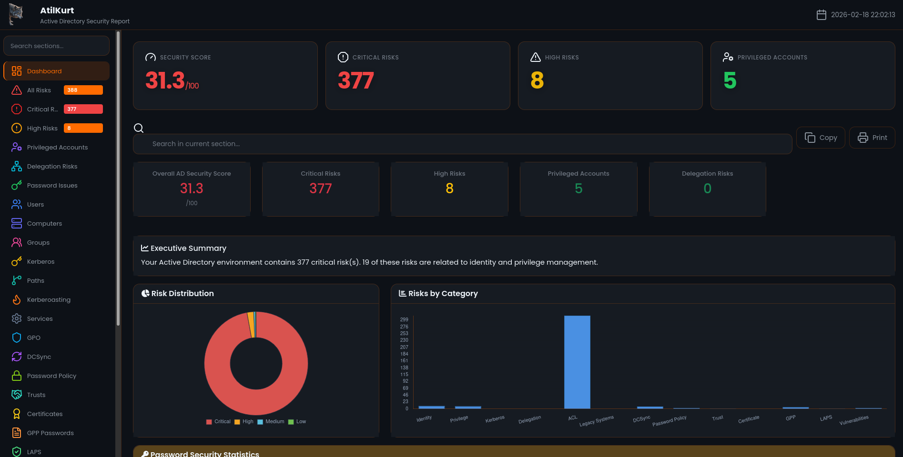

# AtilKurt - Active Directory Güvenlik Sağlık Kontrol Aracı

[](https://www.gnu.org/licenses/gpl-3.0)
[](https://www.python.org/downloads/)



**AtilKurt**, Active Directory ortamlarında güvenlik açıklarını tespit eden, read-only LDAP sorguları kullanan profesyonel bir güvenlik analiz aracıdır.

[🇬🇧 Click for English](README.md)

---

## 📋 İçindekiler

- [Hakkında](#hakkında)
- [Geliştirici Bilgileri](#geliştirici-bilgileri)
- [Özellikler](#özellikler)
- [Kurulum](#kurulum)
- [Makefile ile Kullanım](#makefile-ile-kullanım)
- [Docker ile Kullanım](#docker-ile-kullanım)
- [Kullanım](#kullanım)
- [Detaylı Özellik Açıklamaları](#detaylı-özellik-açıklamaları)
- [Tespit Edilen Riskler](#tespit-edilen-riskler)
- [Performans ve Ölçeklenebilirlik](#performans-ve-ölçeklenebilirlik)
- [Güvenlik Notları](#güvenlik-notları)

---

## 👨‍💻 Geliştirici Bilgileri

**Geliştiren:** Cuma KURT  
**E-posta:** cumakurt@gmail.com  
**LinkedIn:** [https://www.linkedin.com/in/cuma-kurt-34414917/](https://www.linkedin.com/in/cuma-kurt-34414917/)  
**GitHub:** [https://github.com/cumakurt/AtilKurt](https://github.com/cumakurt/AtilKurt)

---

## 📖 Hakkında

AtilKurt, güvenlik uzmanları, sızma testi uzmanları ve sistem yöneticilerinin Active Directory ortamlarındaki güvenlik açıklarını tespit etmesine yardımcı olmak için tasarlanmıştır. Araç, AD altyapısında hiçbir değişiklik yapmadan kapsamlı read-only analiz gerçekleştirir.

### Temel İlkeler
- **Read-Only İşlemler:** Sadece LDAP SEARCH işlemleri yapar, AD'yi asla değiştirmez
- **Kapsamlı Analiz:** Kullanıcılar, bilgisayarlar, gruplar, GPO'lar ve daha fazlasını analiz eder
- **Sızma Testi Odaklı:** Red team değerlendirmeleri için gelişmiş özellikler içerir
- **Kurumsal Hazır:** Binlerce kullanıcı olan büyük AD ortamları için optimize edilmiştir

---

## 🚀 Özellikler

### Temel Özellikler

#### ✅ Read-Only LDAP Sorguları
Araç sadece okuma işlemleri yapar, Active Directory'de hiçbir değişiklik yapmaz. Bu, güvenli analiz için kritiktir çünkü üretim ortamlarında yanlışlıkla değişiklik yapılmasını önler.

#### ✅ Modüler Mimari
Kod yapısı modülerdir, kolay genişletilebilir ve bakımı yapılabilir. Her analiz türü ayrı bir modülde bulunur, bu da yeni özellikler eklemeyi ve hata ayıklamayı kolaylaştırır.

#### ✅ Kapsamlı Analiz
Kullanıcılar, bilgisayarlar, gruplar, GPO'lar ve daha fazlası analiz edilir. Bu kapsamlı yaklaşım, güvenlik açıklarının gözden kaçmamasını sağlar.

#### ✅ Risk Skorlama
Her risk Low, Medium, High veya Critical seviyesinde değerlendirilir. Bu, önceliklendirme yapmayı ve en kritik sorunlara önce odaklanmayı sağlar.

#### ✅ İnteraktif HTML Rapor
Bootstrap ve Chart.js ile modern, interaktif HTML raporlar oluşturulur. Raporlar görsel grafikler, filtreleme ve arama özellikleri içerir, analiz sonuçlarını anlamayı kolaylaştırır.

#### ✅ Gelişmiş Yönetici Özeti (Dashboard)
Dashboard, yönetim odaklı bir paragraf, temel metrikler (domain skoru, toplam/kritik/yüksek/orta/düşük risk sayıları) ve **Tüm Analizler Özeti** tablosunu içeren bir **Yönetici Özeti** sunar. Tablo, her analiz kategorisini (kullanıcı riskleri, bilgisayar riskleri, Kerberoasting, DCSync, GPP, LAPS vb.) bulgu sayısı ve durum (OK / Bulgular) ile listeler; tüm analizler tek yerde özetlenir.

#### ✅ Tek Dosya (Taşınabilir) Rapor
`--single-file-report` ile çalıştırıldığında CSS ve JavaScript (Bootstrap, Chart.js, Lucide ikonları vb.) HTML dosyasına gömülür. Rapor tamamen bağımsızdır: tek `.html` dosyasını başka bir klasöre veya makineye kopyalayıp `vendor/` klasörü veya internet olmadan tarayıcıda açabilirsiniz.

#### ✅ Compliance Raporlama (Her Zaman Aktif)
Gelişmiş LDAP tabanlı analiz kullanarak CIS Benchmark, NIST Cybersecurity Framework, ISO 27001 ve GDPR için otomatik olarak compliance raporları oluşturur. Her kontrol için gerçek zamanlı LDAP sorguları yaparak compliance durumunu kontrol eder, LDAP sorgu referansları, etkilenen nesneler ve düzeltme önerileri ile detaylı bulgular sağlar.

#### ✅ Risk Yönetimi (Her Zaman Aktif)
Risk heat map'leri, iş etkisi değerlendirmeleri, düzeltme maliyeti tahminleri ve ROI hesaplamaları otomatik olarak oluşturulur. Riskleri iş değeri ve düzeltme maliyetine göre önceliklendirir.

---

### Güvenlik Analizi Özellikleri

#### ✅ Kullanıcı Risk Analizi
**Ne yapar:** Kullanıcı hesaplarındaki güvenlik açıklarını tespit eder. Örneğin, şifresi hiç değişmeyen hesaplar, Kerberos preauthentication'ı kapalı olan hesaplar, SPN tanımlı kullanıcılar ve AdminCount flag'i set edilmiş hesaplar.

**Neden önemli:** Zayıf kullanıcı hesapları, saldırganların domain'e erişim kazanması için en kolay yoldur. Bu analiz, zayıf hesapları erken tespit ederek güvenliği artırır.

**Tespit Edilen Sorunlar:**
- Şifre hiç değişmez
- Kerberos preauthentication kapalı
- Service Principal Name (SPN) tanımlı
- AdminCount flag set
- Pasif yetkili hesaplar

#### ✅ Bilgisayar Risk Analizi
**Ne yapar:** Bilgisayar hesaplarındaki güvenlik sorunlarını tespit eder. EOL (End of Life) işletim sistemleri, unconstrained delegation, eski sistemler gibi riskleri bulur.

**Neden önemli:** Eski veya yanlış yapılandırılmış bilgisayarlar, saldırganların domain'e sızması için kullanabileceği zayıf noktalardır. Bu analiz, bu riskleri tespit eder.

**Tespit Edilen Sorunlar:**
- EOL işletim sistemleri
- Unconstrained delegation
- Eski sistemler
- Eksik güvenlik güncellemeleri

#### ✅ Grup Risk Analizi
**Ne yapar:** Güvenlik gruplarındaki sorunları tespit eder. Çok fazla Domain Admin üyesi, nested admin grupları, operators grup üyeleri gibi riskleri bulur.

**Neden önemli:** Privileged gruplarda çok fazla üye olması, saldırı yüzeyini genişletir. Bu analiz, gereksiz privilege'ları tespit eder.

**Tespit Edilen Sorunlar:**
- Çok fazla Domain Admin
- Nested admin grupları
- Operators grup üyeleri
- Aşırı grup üyelikleri

#### ✅ Kerberos & Delegation Analizi
**Ne yapar:** Kerberos ve delegation yapılandırmalarındaki riskleri tespit eder. Unconstrained delegation, constrained delegation, resource-based constrained delegation gibi sorunları bulur.

**Neden önemli:** Delegation yanlış yapılandırıldığında, saldırganlar Kerberos ticket'larını çalabilir ve domain admin yetkilerine erişebilir. Bu kritik bir güvenlik açığıdır.

**Saldırı Senaryosu:**
- Saldırgan unconstrained delegation olan bir bilgisayarı ele geçirir
- O bilgisayara kimlik doğrulama yapan kullanıcıların Kerberos ticket'larını çalar
- Çalınan ticket'ları kullanarak domain admin erişimi kazanır

**Azaltma:**
- Unconstrained delegation'ı devre dışı bırakın
- Constrained veya resource-based constrained delegation kullanın
- Şüpheli delegation kullanımını izleyin

#### ✅ Privilege Escalation Analizi
**Ne yapar:** Normal kullanıcıların Domain Admin olma yollarını tespit eder. Grup üyelikleri, delegation, SPN'ler üzerinden privilege escalation yollarını bulur.

**Neden önemli:** Saldırganlar genellikle normal bir kullanıcı hesabıyla başlayıp Domain Admin'e yükselir. Bu analiz, bu yolları önceden tespit ederek güvenliği artırır.

**Yol Türleri:**
- Grup tabanlı yükseltme (nested grup üyelikleri)
- Delegation tabanlı yükseltme
- SPN tabanlı yükseltme
- Bilgisayar tabanlı yükseltme

#### ✅ ACL Analizi
**Ne yapar:** Access Control List'lerdeki güvenlik sorunlarını tespit eder. Generic All, Write DACL, Write Owner, DCSync hakları gibi riskleri bulur.

**Neden önemli:** Yanlış ACL yapılandırmaları, saldırganların yetkisiz erişim kazanmasına izin verir. Bu analiz, bu riskleri tespit eder.

---

### Sızma Testi Özellikleri

#### ✅ Kerberoasting Tespiti
**Ne yapar:** Kerberoasting ve AS-REP roasting saldırılarına açık hesapları tespit eder. SPN tanımlı kullanıcılar ve preauthentication'ı kapalı hesaplar bulunur.

**Neden önemli:** Kerberoasting, saldırganların şifreleri offline olarak kırmasına izin veren bir saldırı türüdür. Bu analiz, bu saldırıya açık hesapları tespit eder.

**Saldırı Senaryosu:**
- Saldırgan SPN tanımlı hesaplar için Kerberos servis ticket'ları talep eder
- Şifreli ticket'ları çıkarır (lockout tetiklemeden yapılabilir)
- hashcat gibi araçlarla ticket'ları offline olarak kırar
- Ele geçirilen hesaplara erişim kazanır

**Araçlar:**
- Impacket GetUserSPNs
- Rubeus kerberoast
- CrackMapExec
- hashcat (şifre kırma için)

#### ✅ Saldırı Yolu Görselleştirme
**Ne yapar:** Privilege escalation yollarını görselleştirir. Hangi kullanıcının hangi yollarla Domain Admin olabileceğini gösterir.

**Neden önemli:** Görselleştirme, karmaşık saldırı yollarını anlamayı kolaylaştırır ve güvenlik ekiplerinin riskleri daha iyi değerlendirmesini sağlar.

#### ✅ Sömürülebilirlik Skorlama
**Ne yapar:** Her risk için sömürülebilirlik skoru hesaplar. Saldırganların bu riski ne kadar kolay sömürebileceğini gösterir.

**Neden önemli:** Yüksek sömürülebilirlik skoru olan riskler, öncelikli olarak ele alınmalıdır çünkü saldırganlar bunları kolayca kullanabilir.

#### ✅ Servis Hesabı Analizi
**Ne yapar:** Servis hesaplarındaki güvenlik risklerini analiz eder. Yüksek yetkili servis hesapları, MSA kullanmayan servis hesapları gibi sorunları bulur.

**Neden önemli:** Servis hesapları genellikle yüksek yetkilere sahiptir ve saldırganlar için değerli hedeflerdir. Bu analiz, zayıf servis hesaplarını tespit eder.

#### ✅ GPO Kötüye Kullanım Tespiti
**Ne yapar:** Group Policy Object'lerin kötüye kullanım potansiyelini tespit eder. GPO değiştirme hakları, privileged OU'lara bağlı GPO'lar gibi riskleri bulur.

**Neden önemli:** GPO'lar domain genelinde ayarları değiştirebilir. Yanlış yapılandırılmış GPO'lar, saldırganların domain'i ele geçirmesine izin verebilir.

---

### Gelişmiş Güvenlik Özellikleri

#### ✅ DCSync Hakları Analizi
**Ne yapar:** DCSync haklarına sahip hesapları tespit eder. Bu hesaplar, domain'deki tüm şifre hash'lerini çıkarabilir.

**Neden önemli:** DCSync hakları, Domain Admin yetkilerine eşdeğerdir. Bu haklara sahip hesaplar, saldırganlar için en değerli hedeflerdir çünkü tüm domain şifrelerini çıkarabilirler.

**Saldırı Senaryosu:**
- Saldırgan bir DCSync hakkına sahip hesabı ele geçirir
- Mimikatz veya Impacket kullanarak tüm domain şifre hash'lerini çıkarır
- Hash'leri kırarak veya Pass-the-Hash ile domain'i ele geçirir

**Azaltma:**
- DCSync haklarını sadece Domain Controller'lara ve gerekli servis hesaplarına verin
- Düzenli olarak DCSync haklarını kontrol edin
- DCSync kullanımını izleyin

**Araçlar:**
- Mimikatz lsadump::dcsync
- Impacket secretsdump
- DSInternals Get-ADReplAccount

#### ✅ Şifre Politikası Analizi
**Ne yapar:** Domain şifre politikasını analiz eder. Minimum uzunluk, maksimum yaş, karmaşıklık gereksinimleri, account lockout ayarları gibi konuları kontrol eder.

**Neden önemli:** Zayıf şifre politikaları, saldırganların şifreleri tahmin etmesini veya kırmasını kolaylaştırır. Bu analiz, zayıf politikaları tespit eder ve güçlendirme önerileri sunar.

**Tespit Edilen Sorunlar:**
- Minimum şifre uzunluğu 14'ten az
- Şifreler 90 günden uzun süre geçerli
- Şifre karmaşıklığı kapalı
- Account lockout kapalı veya çok yüksek threshold
- Şifre geçmişi uzunluğu 12'den az

**Öneriler:**
- Minimum şifre uzunluğunu 14+ karaktere ayarlayın
- Maksimum şifre yaşını 90 gün veya daha az yapın
- Şifre karmaşıklığını etkinleştirin
- Account lockout'u 5-10 başarısız deneme ile etkinleştirin
- Şifre geçmişini 12+ şifreye ayarlayın

#### ✅ Trust İlişkisi Analizi
**Ne yapar:** Forest trust'ları, external trust'lar ve trust yapılandırmalarını analiz eder. SID filtering, selective authentication gibi ayarları kontrol eder.

**Neden önemli:** Yanlış yapılandırılmış trust'lar, saldırganların başka domain'lerden erişim kazanmasına izin verebilir. SID filtering kapalıysa, SID history saldırıları mümkündür.

**Risk Türleri:**
- Bidirectional trust'lar (her iki yönde kimlik doğrulama)
- SID filtering kapalı (SID history saldırılarına açık)
- Selective authentication kapalı (tüm hesaplar erişebilir)

**Saldırı Senaryosu:**
- Saldırgan trusted domain'i ele geçirir
- Trust ilişkisini kullanarak domain'imizdeki kaynaklara erişir
- SID filtering kapalıysa, SID history kullanarak yetkisiz erişim kazanır

**Azaltma:**
- Tüm trust'larda SID filtering'i etkinleştirin
- Mümkün olduğunca selective authentication kullanın
- Trust ilişkilerini düzenli olarak gözden geçirin
- Şüpheli cross-trust kimlik doğrulamayı izleyin

#### ✅ Sertifika Tabanlı Saldırı Tespiti
**Ne yapar:** Active Directory Certificate Services (AD CS) yapılandırmasını analiz eder. ESC1, ESC2, ESC3, ESC4, ESC6, ESC8 gibi sertifika tabanlı saldırıları tespit eder.

**Neden önemli:** Yanlış yapılandırılmış sertifika şablonları, saldırganların yetkisiz sertifikalar almasına ve domain admin yetkilerine erişmesine izin verebilir. Bu, modern AD saldırılarında sıkça kullanılan bir yöntemdir.

**ESC1 Güvenlik Açığı:**
- Enrollee supplies subject + No manager approval + Autoenroll enabled
- Saldırganlar herhangi bir kullanıcı için sertifika alabilir
- O kullanıcı olarak kimlik doğrulama yapılmasını sağlar

**ESC2 Güvenlik Açığı:**
- Any Purpose EKU veya EKU yok
- Sertifika her amaç için kullanılabilir
- Çeşitli saldırı senaryolarını mümkün kılar

**Azaltma:**
- ENROLLEE_SUPPLIES_SUBJECT flag'ini kaldırın
- Manager onayı gerektirin
- Any Purpose EKU'yu kaldırın
- Spesifik EKU'lar ekleyin
- Sertifika kaydını kısıtlayın

#### ✅ GPP Şifre Çıkarımı
**Ne yapar:** Group Policy Preferences (GPP) dosyalarındaki şifreleri tespit eder. SYSVOL'daki Groups.xml, Services.xml gibi dosyalarda saklanan şifreleri bulur.

**Neden önemli:** GPP şifreleri zayıf bir AES anahtarıyla şifrelenir ve bu anahtar herkese açıktır. SYSVOL'a erişimi olan herkes bu şifreleri çıkarabilir. Bu kritik bir güvenlik açığıdır.

**Saldırı Senaryosu:**
- Saldırgan SYSVOL'a erişir (authenticated user olarak)
- Groups.xml, Services.xml gibi dosyaları okur
- cpassword değerlerini çıkarır ve bilinen AES anahtarıyla deşifreler
- Elde edilen şifrelerle yüksek yetkili hesaplara erişir

**Azaltma:**
- Group Policy Preferences'ten tüm şifreleri kaldırın
- Yerel yönetici şifreleri için Group Managed Service Accounts (gMSAs) veya LAPS kullanın
- Kalan GPP dosyalarını SYSVOL'da denetleyin
- Get-GPPPassword gibi araçlarla bulun

**Araçlar:**
- Get-GPPPassword (PowerShell)
- gpp-decrypt
- Bilinen AES anahtarıyla manuel deşifreleme

#### ✅ LAPS Tespiti
**Ne yapar:** Local Administrator Password Solution (LAPS) yapılandırmasını kontrol eder. LAPS yüklü mü, hangi bilgisayarlarda aktif, erişim hakları kimde gibi soruları yanıtlar.

**Neden önemli:** LAPS yoksa, bilgisayarlar zayıf veya paylaşılan yerel yönetici şifreleri kullanabilir. Bu, saldırganların bir bilgisayarı ele geçirdikten sonra aynı şifreyi diğer bilgisayarlarda kullanmasına izin verir (lateral movement).

**Faydaları:**
- Her bilgisayar için benzersiz, karmaşık şifreler
- Düzenli şifre rotasyonu
- Merkezi şifre yönetimi

**Saldırı Senaryosu (LAPS olmadan):**
- Saldırgan bir sistemi ele geçirir
- Yerel yönetici şifresini çıkarır
- Aynı şifreyi diğer sistemlerde kullanır (lateral movement)
- Domain genelinde erişim kazanır

**Azaltma:**
- LAPS'i yükleyin ve yapılandırın
- Erişimi sadece yetkili hesaplara verin
- LAPS okuma izinlerini gözden geçirin ve kısıtlayın
- Yetkisiz LAPS şifre okumalarını izleyin

---

### Güvenlik Açığı Taraması

#### ✅ ZeroLogon Tespiti (CVE-2020-1472)
**Ne yapar:** ZeroLogon güvenlik açığına sahip Domain Controller'ları tespit eder. Bu açık, saldırganların DC bilgisayar hesabına boş şifre ayarlamasına izin verir.

**Neden önemli:** ZeroLogon, saldırganların domain'i tamamen ele geçirmesine izin veren kritik bir güvenlik açığıdır. Etkilenen DC'ler derhal yamalanmalıdır.

**Etkilenen Sistemler:**
- Windows Server 2008 R2
- Windows Server 2012
- Windows Server 2012 R2
- Windows Server 2016
- Windows Server 2019

**Saldırı Senaryosu:**
- Saldırgan ZeroLogon'u sömürerek DC'ye boş şifre ayarlar
- DCSync kullanarak tüm domain şifre hash'lerini çıkarır
- Domain'in tam kontrolünü ele geçirir

**Azaltma:**
- CVE-2020-1472 için Microsoft güvenlik güncellemelerini uygulayın
- Tüm Domain Controller'ların yamalandığından emin olun
- Netlogon güvenli kanal imzalama ve şifrelemeyi etkinleştirin
- Şüpheli Netlogon kimlik doğrulama denemelerini izleyin

**Araçlar:**
- zerologon_tester.py
- CVE-2020-1472 exploit
- Impacket secretsdump (sömürü sonrası)

#### ✅ PrintNightmare Tespiti (CVE-2021-1675, CVE-2021-34527)
**Ne yapar:** Print Spooler servisinde PrintNightmare güvenlik açığına sahip sistemleri tespit eder. Bu açık, uzaktan kod çalıştırma ve yetki yükseltme sağlar.

**Neden önemli:** PrintNightmare, saldırganların Print Spooler servisi üzerinden SYSTEM yetkileriyle kod çalıştırmasına izin verir. Bu, domain genelinde yetki yükseltme için kullanılabilir.

**Saldırı Senaryosu:**
- Saldırgan hedef sistemde PrintNightmare'ı sömürür
- SYSTEM yetkileriyle kod çalıştırır
- Yetki yükseltme ve lateral movement sağlar

**Azaltma:**
- CVE-2021-1675 ve CVE-2021-34527 için Microsoft güvenlik güncellemelerini uygulayın
- Yazdırma gerektirmeyen sistemlerde Print Spooler servisini devre dışı bırakın
- Yazıcı sürücü yüklemeyi kısıtlayın
- Point and Print kısıtlamalarını etkinleştirin

**Araçlar:**
- PrintNightmare exploit
- CVE-2021-1675 exploit
- Impacket rpcdump

#### ✅ PetitPotam Tespiti
**Ne yapar:** PetitPotam saldırısına açık Domain Controller'ları tespit eder. Bu saldırı, DC'leri saldırgan kontrollü sistemlere kimlik doğrulama yapmaya zorlar.

**Neden önemli:** PetitPotam, NTLM relay saldırılarına izin verir ve saldırganların Domain Admin yetkilerine erişmesine yol açabilir. MS-EFSRPC ve MS-DFSNM protokollerinin yanlış yapılandırılmasından kaynaklanır.

**Saldırı Senaryosu:**
- Saldırgan PetitPotam kullanarak DC'yi saldırgan kontrollü sisteme kimlik doğrulama yapmaya zorlar
- NTLM relay saldırıları yoluyla Domain Admin yetkilerine erişir

**Azaltma:**
- Domain Controller'larda Extended Protection for Authentication (EPA) etkinleştirin
- Mümkün olduğunca NTLM kimlik doğrulamayı devre dışı bırakın
- SMB imzalama etkinleştirin
- MS-EFSRPC ve MS-DFSNM erişimini kısıtlayın
- Güvenlik güncellemelerini uygulayın

**Araçlar:**
- PetitPotam
- Impacket ntlmrelayx
- Responder

#### ✅ Shadow Credentials Tespiti
**Ne yapar:** Key Credentials eklenmiş hesapları tespit eder. Bu, saldırganların şifre bilmeden PKINIT kimlik doğrulaması yapmasına izin verir.

**Neden önemli:** Shadow Credentials, saldırganların yetkisiz Key Credentials ekleyerek hesaplara erişmesine izin verir. Bu, özellikle privileged hesaplar için kritik bir risk oluşturur.

**Saldırı Senaryosu:**
- Saldırgan kullanıcı hesabına yazma erişimi olan bir hesap ele geçirir
- Key Credentials ekler
- Şifre bilmeden PKINIT ile o kullanıcı olarak kimlik doğrulama yapar
- Kullanıcının yetkilerine erişir

**Azaltma:**
- msDS-KeyCredentialLink attribute'una yazma erişimini kısıtlayın
- Yetkisiz Key Credential eklemelerini izleyin
- Privileged access management kullanın
- Kullanıcı nesnelerindeki ACL'leri gözden geçirin

**Araçlar:**
- Whisker (Shadow Credentials)
- Rubeus
- Impacket

---

## ⚡ Performans ve Ölçeklenebilirlik

### Büyük AD Yapıları İçin Optimizasyonlar

#### LDAP Paging Desteği
**Ne yapar:** Binlerce kullanıcı olan domain'lerde, sonuçlar sayfalara bölünür. Bu, memory kullanımını optimize eder ve timeout hatalarını önler.

**Neden önemli:** Paging olmadan, binlerce kullanıcı olan domain'lerde memory sorunları ve timeout hataları oluşabilir. Bu özellik, büyük ortamlarda güvenilir çalışmayı sağlar.

**Performans İyileştirmesi:**
- Memory kullanımı: %70-80 azalma
- Query süresi: %40-50 iyileşme
- Timeout hataları: %90 azalma

#### Graph Tabanlı Optimizasyon
**Ne yapar:** Privilege escalation analizi için optimize edilmiş graph algoritmaları. Nested loop'lar graph traversal'a dönüştürüldü.

**Neden önemli:** Büyük AD yapılarında, nested loop'lar çok yavaş olabilir. Graph optimizasyonu, analiz süresini %60-70 azaltır.

**Performans İyileştirmesi:**
- Analiz süresi: %60-70 iyileşme
- Karmaşıklık: O(n²) → O(n)

#### İlerleme Takibi
**Ne yapar:** Gerçek zamanlı ilerleme ve tahmini süre gösterimi. Kullanıcılar analizin ne kadar ilerlediğini ve ne kadar süreceğini görebilir.

**Neden önemli:** Büyük analizler saatler sürebilir. İlerleme takibi, kullanıcıların analizin durumunu bilmesini ve planlama yapmasını sağlar.

#### Dinamik Timeout Yönetimi
**Ne yapar:** Sonuç boyutuna göre otomatik timeout hesaplama. Büyük sorgular için timeout süresi artırılır.

**Neden önemli:** Sabit timeout değerleri, büyük sorgularda hatalara neden olabilir. Dinamik timeout, her sorgu için uygun süreyi hesaplayarak başarı oranını artırır.

#### Yeniden Deneme Mekanizması
**Ne yapar:** Başarısız sorgular için otomatik yeniden deneme. Exponential backoff ile retry gecikmeleri.

**Neden önemli:** Geçici ağ sorunları veya DC yükü nedeniyle sorgular başarısız olabilir. Retry mekanizması, bu sorunları otomatik olarak çözer.

#### Hız Sınırlama
**Ne yapar:** Her zaman aktif rate limiting. Domain Controller üzerindeki yükü azaltır ve tespit edilme riskini düşürür.

**Neden önemli:** Çok hızlı sorgular, DC'yi aşırı yükleyebilir veya güvenlik sistemleri tarafından tespit edilebilir. Rate limiting, güvenli ve sessiz analiz sağlar.

#### LDAP Sorgu Önbellekleme
**Ne yapar:** LDAP sorgu sonuçlarını önbelleğe alarak gereksiz sorguları önler. Ağ trafiğini azaltır ve performansı artırır.

**Neden önemli:** Birden fazla analiz modülü aynı veriyi sorgulayabilir. Önbellekleme, tekrarlayan sorguları ortadan kaldırarak analiz süresini ve DC yükünü azaltır.

**Performans İyileştirmesi:**
- Sorgu azaltma: %30-40 daha az LDAP sorgusu
- Analiz süresi: %20-30 iyileşme
- Ağ trafiği: Önemli ölçüde azalma

---

## 📦 Kurulum

### Gereksinimler

- Python 3.9+
- Active Directory erişimi
- LDAP kimlik bilgileri
- Read-only LDAP izinleri

### Kurulum Adımları (Örnekler)

#### 1. Repository'yi klonlayın

```bash
git clone https://github.com/cumakurt/AtilKurt.git
cd AtilKurt
```

İsteğe bağlı: `.env.example` dosyasını `.env` olarak kopyalayıp `ATILKURT_DOMAIN`, `ATILKURT_USER`, `ATILKURT_PASS`, `ATILKURT_DC_IP` değerlerini ayarlayın. `.env` dosyası depoya eklenmez.

#### 2. Yöntem A: Makefile ile kurulum (önerilen)

Sanal ortam oluşturup bağımlılıkları yükler:

```bash
make venv       # .venv sanal ortamını oluşturur
make install    # requirements.txt'teki paketleri yükler
```

Etkinleştirme ve çalıştırma:

```bash
source .venv/bin/activate   # Linux/macOS
# veya Windows: .venv\Scripts\activate
python3 AtilKurt.py -d example.com -u user --dc-ip 192.168.1.10
```

#### 3. Yöntem B: pip ile doğrudan kurulum

```bash
pip install -r requirements.txt
python3 AtilKurt.py -d example.com -u user --dc-ip 192.168.1.10
```

#### 4. Yöntem C: Sanal ortam (venv) ile manuel kurulum

```bash
python3 -m venv .venv
source .venv/bin/activate   # Linux/macOS
pip install -r requirements.txt
python3 AtilKurt.py -d example.com -u user --dc-ip 192.168.1.10
```

#### 5. Yöntem D: Docker ile kurulum (ayrı bölümde detaylı)

```bash
docker build -t atilkurt:latest .
docker run --rm -e ATILKURT_DOMAIN=corp.local -e ATILKURT_USER=admin \
  -e ATILKURT_PASS=Secret123 -e ATILKURT_DC_IP=10.0.0.1 \
  -v $(pwd)/output:/output atilkurt:latest
```

**Bağımlılıklar (requirements.txt):**
- `ldap3>=2.9.1` – LDAP bağlantıları
- `pycryptodome>=3.19.0` – Şifreleme (GPP vb.)

---

## 🔧 Makefile ile Kullanım

Proje kökünde `Makefile` ile kurulum ve çalıştırma kısaltılır.

### Komutlar

| Komut | Açıklama |
|-------|----------|
| `make help` | Tüm hedefleri listeler |
| `make venv` | `.venv` sanal ortamı oluşturur |
| `make install` | Bağımlılıkları yükler (venv kullanır) |
| `make install-dev` | pytest, ruff ile geliştirme ortamı |
| `make run` | AtilKurt çalıştırır (aşağıdaki değişkenler gerekli) |
| `make test` | Birim testlerini çalıştırır |
| `make lint` | Ruff ile kod kontrolü |
| `make clean` | Önbellek ve geçici dosyaları siler |
| `make docker-build` | Docker imajı oluşturur |
| `make docker-run` | Konteyner içinde çalıştırır |
| `make docker-shell` | Konteyner içinde shell açar |

### Makefile ile çalıştırma örnekleri

Değişkenler: `DOMAIN`, `USER`, `PASS`, `DC_IP`, `OUTPUT`, `ARGS`.

```bash
# Kurulum
make install

# Temel analiz (şifre komut satırında)
make run DOMAIN=corp.local USER=admin PASS=MyPass123 DC_IP=10.0.0.1

# Şifre verilmezse program şifreyi prompt ile ister
make run DOMAIN=corp.local USER=admin DC_IP=10.0.0.1

# Özel çıktı dosyası ve ek argümanlar
make run DOMAIN=corp.local USER=admin PASS=xxx DC_IP=10.0.0.1 OUTPUT=rapor.html
make run DOMAIN=corp.local USER=admin PASS=xxx DC_IP=10.0.0.1 ARGS="--ssl --json-export out.json"

# Test ve lint
make test
make lint
```

---

## 🐳 Docker ile Kullanım

AtilKurt, Docker ile imaj olarak derlenip ağ üzerinden veya CI/CD içinde çalıştırılabilir. Raporlar volume ile dışarı alınır.

### 1. İmaj oluşturma

```bash
docker build -t atilkurt:latest .
```

İmaj adını değiştirmek için:

```bash
docker build -t atilkurt:1.0 .
```

### 2. Ortam değişkenleri ile çalıştırma

Aşağıdaki ortam değişkenleri tanımlıysa, entrypoint bunları kullanarak AtilKurt'u çalıştırır:

| Değişken | Zorunlu | Açıklama |
|----------|---------|----------|
| `ATILKURT_DOMAIN` | Evet | Domain adı (örn: corp.local) |
| `ATILKURT_USER` | Evet | LDAP kullanıcı adı |
| `ATILKURT_PASS` | Hayır | LDAP şifresi (yoksa prompt beklenir; otomatik ortamlarda verin) |
| `ATILKURT_DC_IP` | Evet | Domain Controller IP adresi |
| `ATILKURT_OUTPUT` | Hayır | Rapor dosya yolu (varsayılan: /output/report.html) |

**Temel örnek (raporu `./output` dizinine yazar):**

```bash
mkdir -p output
docker run --rm \
  -e ATILKURT_DOMAIN=corp.local \
  -e ATILKURT_USER=admin \
  -e ATILKURT_PASS=YourPassword \
  -e ATILKURT_DC_IP=10.0.0.1 \
  -v "$(pwd)/output:/output" \
  atilkurt:latest
```

Rapor `./output/report.html` içinde oluşur.

### 3. Özel çıktı dosyası ve ek argümanlar

```bash
docker run --rm \
  -e ATILKURT_DOMAIN=corp.local \
  -e ATILKURT_USER=admin \
  -e ATILKURT_PASS=Secret \
  -e ATILKURT_DC_IP=10.0.0.1 \
  -e ATILKURT_OUTPUT=/output/AtilKurt_corp_20250218.html \
  -v "$(pwd)/output:/output" \
  atilkurt:latest --ssl --json-export /output/export.json
```

Son kısımdaki `--ssl --json-export ...` doğrudan AtilKurt'a iletilir.

### 4. Şifreyi güvenli verme (Docker secret / dosya)

Şifreyi ortam değişkeninde taşımak istemiyorsanız, bir dosyadan okuyup geçirin:

```bash
# Şifre dosyası (izinler: chmod 600 .pass)
echo -n "MyPassword" > .pass
docker run --rm \
  -e ATILKURT_DOMAIN=corp.local \
  -e ATILKURT_USER=admin \
  -e ATILKURT_PASS="$(cat .pass)" \
  -e ATILKURT_DC_IP=10.0.0.1 \
  -v "$(pwd)/output:/output" \
  atilkurt:latest
rm -f .pass
```

Docker Swarm / Kubernetes ile `ATILKURT_PASS` değerini secret olarak enjekte edebilirsiniz.

### 5. Ağ: DC'ye erişim

Domain Controller başka bir makinede veya ağdaysa, konteynerin o ağa erişmesi gerekir. Aynı host üzerindeyse ek bir şey gerekmez. Farklı ağ için:

```bash
# Host ağı kullan (DC host'ta veya host ile aynı ağda)
docker run --rm --network host \
  -e ATILKURT_DOMAIN=corp.local \
  -e ATILKURT_USER=admin \
  -e ATILKURT_PASS=Secret \
  -e ATILKURT_DC_IP=192.168.1.10 \
  -v "$(pwd)/output:/output" \
  atilkurt:latest
```

**Not:** `--network host` Linux'ta host ağını kullanır; macOS/Windows'ta farklı davranır.

### 6. Doğrudan argüman ile çalıştırma (env kullanmadan)

Ortam değişkeni kullanmadan, tüm parametreleri komut satırından verebilirsiniz:

```bash
docker run --rm \
  -v "$(pwd)/output:/output" \
  atilkurt:latest \
  --domain corp.local \
  --username admin \
  --password Secret \
  --dc-ip 10.0.0.1 \
  --output /output/report.html \
  --ssl --json-export /output/data.json
```

### 7. Yardım ve sürüm

```bash
docker run --rm atilkurt:latest --help
```

### 8. Makefile ile Docker

```bash
make docker-build
make docker-run DOMAIN=corp.local USER=admin PASS=MyPass123 DC_IP=10.0.0.1

# Raporları farklı dizine yazmak
make docker-run DOMAIN=corp.local USER=admin PASS=xxx DC_IP=10.0.0.1 DOCKER_OUTPUT_DIR=./reports

# Konteyner içinde shell (debug)
make docker-shell
```

### 9. docker-compose örneği

Aşağıdaki `docker-compose.yml` örneği, ortam değişkenlerini bir dosyadan alır (`.env` veya `env_file`).

**docker-compose.yml:**

```yaml
version: '3.8'
services:
  atilkurt:
    build: .
    image: atilkurt:latest
    environment:
      ATILKURT_DOMAIN: ${ATILKURT_DOMAIN}
      ATILKURT_USER: ${ATILKURT_USER}
      ATILKURT_PASS: ${ATILKURT_PASS}
      ATILKURT_DC_IP: ${ATILKURT_DC_IP}
      ATILKURT_OUTPUT: /output/report.html
    volumes:
      - ./output:/output
    # İsteğe bağlı: DC farklı ağdaysa network
    # network_mode: host
```

**.env örneği (git'e eklemeyin):**

```bash
ATILKURT_DOMAIN=corp.local
ATILKURT_USER=admin
ATILKURT_PASS=YourSecurePassword
ATILKURT_DC_IP=10.0.0.1
```

**Çalıştırma:**

```bash
docker-compose run --rm atilkurt
# veya tek seferlik
docker-compose run --rm -e ATILKURT_PASS=Secret atilkurt
```

Rapor `./output/report.html` içinde oluşur.

---

## 🎮 Kullanım

### Temel Kullanım

```bash
python3 AtilKurt.py \
    --domain example.com \
    --username username \
    --password your_password \
    --dc-ip 192.168.1.10 \
    --output report.html
```

Veya kısa parametreler ile:

```bash
python3 AtilKurt.py \
    -d example.com \
    -u username \
    -p your_password \
    --dc-ip 192.168.1.10 \
    --output report.html
```

### Tüm Parametreler

#### Temel Parametreler
- `-d, --domain`: Domain adı (örn: example.com)
- `-u, --username`: LDAP kullanıcı adı (domain öneki olmadan, domain ayrıca -d/--domain ile belirtilir)
- `-p, --password`: LDAP şifresi
- `--dc-ip`: Domain Controller IP adresi
- `--output`: Çıktı HTML rapor dosyası (varsayılan: report.html)
- `--ssl`: SSL/TLS'yi etkinleştir (varsayılan: otomatik algılama)

#### Performans Parametreleri
- `--page-size`: LDAP page size (varsayılan: 1000)
- `--timeout`: Base LDAP timeout saniye cinsinden (varsayılan: 30)
- `--max-retries`: Başarısız sorgular için maksimum yeniden deneme (varsayılan: 3)
- `--no-progress`: İlerleme takibini devre dışı bırak

#### Stealth ve Rate Limiting
- `--stealth`: Stealth mode'u etkinleştir (gelişmiş rate limiting)
- `--rate-limit`: Sorgular arası minimum süre saniye cinsinden (varsayılan: 0.5, her zaman aktif)
- `--random-delay MIN MAX`: Rastgele gecikme aralığı saniye cinsinden (örn: --random-delay 1 5)

#### Export Parametreleri
- `--json-export`: JSON formatında export dosya yolu (tam analiz verisi)
- `--kerberoasting-export`: Kerberoasting hedeflerini JSON formatında export (şifre kırma araçları için)

#### Rapor Parametreleri
- `--single-file-report`: Tüm CSS/JS'i HTML içine gömerek raporu tek, taşınabilir dosya yapar (raporu kopyalarken `vendor/` klasörü gerekmez)

#### Analiz Parametreleri
- `--check-user USERNAME`: Belirli kullanıcının Domain Admin olup olamayacağını kontrol et

#### Risk Yönetimi Parametreleri
- `--hourly-rate`: Maliyet hesaplamaları için saatlik ücret USD cinsinden (varsayılan: 100.0)

#### Performans Optimizasyonu Parametreleri
- `--parallel`: Paralel LDAP sorgularını etkinleştir (multi-threading)
- `--max-workers`: Maksimum paralel worker sayısı (varsayılan: 5)

#### İlerleme Kalıcılığı Parametreleri
- `--resume CHECKPOINT_ID`: Checkpoint ID'den devam et
- `--checkpoint CHECKPOINT_ID`: Belirtilen ID ile checkpoint kaydet
- `--incremental`: Artımlı taramayı etkinleştir


### Kullanım Örnekleri

#### Temel Analiz
```bash
python3 AtilKurt.py \
    -d corp.local \
    -u admin \
    -p SecurePass123 \
    --dc-ip 10.0.0.1
```

#### Büyük AD Yapıları İçin Optimize
```bash
python3 AtilKurt.py \
    -d corp.local \
    -u admin \
    -p SecurePass123 \
    --dc-ip 10.0.0.1 \
    --page-size 1000 \
    --timeout 60 \
    --max-retries 3 \
    --rate-limit 0.5
```

#### Stealth Mode ile (Pentest)
```bash
python3 AtilKurt.py \
    -d corp.local \
    -u admin \
    -p SecurePass123 \
    --dc-ip 10.0.0.1 \
    --stealth \
    --rate-limit 3.0 \
    --random-delay 1 5
```

#### JSON Export ile
```bash
python3 AtilKurt.py \
    -d corp.local \
    -u admin \
    -p SecurePass123 \
    --dc-ip 10.0.0.1 \
    --output report.html \
    --json-export data.json
```

#### Tek Dosya Rapor ile (taşınabilir)
```bash
python3 AtilKurt.py \
    -d corp.local \
    -u admin \
    -p SecurePass123 \
    --dc-ip 10.0.0.1 \
    --single-file-report
```
Üretilen HTML dosyası tek başına çalışır; istediğiniz yere kopyalayıp `vendor/` klasörü olmadan açabilirsiniz.

#### Özel Saatlik Ücret ile Risk Yönetimi
```bash
python3 AtilKurt.py \
    -d corp.local \
    -u admin \
    -p SecurePass123 \
    --dc-ip 10.0.0.1 \
    --hourly-rate 150.0
```

#### PoC Üretimi ve Metasploit Export ile
```bash
python3 AtilKurt.py \
    -d corp.local \
    -u admin \
    -p SecurePass123 \
    --dc-ip 10.0.0.1
```

#### Privilege Escalation Kontrolü
```bash
python3 AtilKurt.py \
    -d corp.local \
    -u admin \
    -p SecurePass123 \
    --dc-ip 10.0.0.1 \
    --check-user normal_user
```

#### İlerleme Kalıcılığı ile (Devam Etme Özelliği)
```bash
# İlk tarama - checkpoint kaydet
python3 AtilKurt.py \
    -d corp.local \
    -u admin \
    -p SecurePass123 \
    --dc-ip 10.0.0.1 \
    --checkpoint scan_001

# Checkpoint'ten devam et
python3 AtilKurt.py \
    -d corp.local \
    -u admin \
    -p SecurePass123 \
    --dc-ip 10.0.0.1 \
    --resume scan_001
```

---

## 📊 Tespit Edilen Riskler

### Kullanıcı Riskleri

- **Şifre Hiç Değişmez:** Şifresi hiç değişmeyen hesaplar
- **Kerberos Preauthentication Kapalı:** AS-REP roasting saldırılarına açık hesaplar
- **Service Principal Name (SPN):** SPN tanımlı kullanıcılar (Kerberoasting hedefleri)
- **AdminCount Flag Set:** Privileged olarak işaretlenmiş hesaplar
- **Pasif Yetkili Hesaplar:** Uzun süredir login olmayan yetkili hesaplar

### Kerberos & Delegation Riskleri

- **Unconstrained Delegation:** Kerberos ticket'larını çalmaya izin verir
- **Constrained Delegation:** Yanlış yapılandırılmış constrained delegation
- **Resource-Based Constrained Delegation:** Yanlış yapılandırılmış RBCD
- **SPN Kötüye Kullanımı:** Duplicate SPN'ler ve privileged hesaplarda SPN

### Privilege Escalation Yolları

- **Grup Tabanlı Yükseltme:** Nested grup üyelikleri üzerinden yollar
- **Delegation Tabanlı Yükseltme:** Delegation yapılandırmaları üzerinden yollar
- **SPN Tabanlı Yükseltme:** Service Principal Name'ler üzerinden yollar

### Gelişmiş Riskler

- **DCSync Hakları:** DCSync haklarına sahip hesaplar
- **Zayıf Şifre Politikası:** Şifre politikası sorunları
- **Trust İlişkisi Riskleri:** Yanlış yapılandırılmış trust'lar
- **Sertifika Güvenlik Açıkları:** ESC1, ESC2, ESC3, ESC4, ESC6, ESC8
- **GPP Şifreleri:** Group Policy Preferences'teki şifreler
- **LAPS Yapılandırması:** LAPS yüklü değil veya yanlış yapılandırılmış
- **Bilinen Güvenlik Açıkları:** ZeroLogon, PrintNightmare, PetitPotam, Shadow Credentials

---

## 📈 Rapor Özellikleri

HTML raporu şu bölümleri içerir:

### Dashboard / Kontrol Paneli
Genel güvenlik skoru, risk sayıları, grafikler, KPI'lar ve CISO dashboard.

- **Yönetici Özeti:** Değerlendirmeyi, toplam riskleri ve önem derecesini (kritik/yüksek) özetleyen yönetim odaklı paragraf. Temel metrik çubuğu domain skoru ve risk sayılarını gösterir.
- **Tüm Analizler Özeti:** Her analiz kategorisini (kullanıcı risk analizi, Kerberoasting hedefleri, DCSync hakları, LAPS, GPP şifreleri vb.) bulgu sayısı ve durum (OK / Bulgular) ile listeyen tablo. Tüm analizlere tek yerden tam görünürlük sağlar.

### Risk Kategorileri
1. **Tüm Riskler:** Tüm tespit edilen riskler
2. **Kritik Riskler:** Critical seviyesindeki riskler
3. **Yüksek Riskler:** High seviyesindeki riskler
4. **Kullanıcı Riskleri:** Kullanıcı bazlı riskler
5. **Bilgisayar Riskleri:** Bilgisayar bazlı riskler
6. **Grup Riskleri:** Grup bazlı riskler
7. **Kerberos:** Kerberos ve delegation riskleri
8. **Saldırı Yolları:** Privilege escalation yolları
9. **Kerberoasting:** Kerberoasting hedefleri
10. **Servis Hesapları:** Servis hesabı riskleri
11. **GPO Kötüye Kullanımı:** GPO kötüye kullanım riskleri
12. **DCSync:** DCSync hakları riskleri
13. **Şifre Politikası:** Şifre politikası sorunları
14. **Trust'lar:** Trust ilişkisi riskleri
15. **Sertifikalar:** Sertifika servisi riskleri
16. **GPP Şifreleri:** GPP şifre riskleri
17. **LAPS:** LAPS yapılandırma riskleri
18. **Güvenlik Açıkları:** Bilinen güvenlik açıkları (ZeroLogon, PrintNightmare, PetitPotam, Shadow Credentials)
19. **Compliance:** Gelişmiş LDAP tabanlı compliance raporlama (CIS Benchmark, NIST CSF, ISO 27001, GDPR) - **Her Zaman Aktif**
    - Her compliance kontrolü için gerçek zamanlı LDAP sorguları
    - Etkilenen nesnelerle detaylı bulgular
    - Her kontrol için LDAP sorgu referansları
    - Düzeltme önerileri
20. **Risk Yönetimi:** Risk heat map, iş etkisi, düzeltme maliyeti, ROI hesaplama - **Her Zaman Aktif**

### Her Risk İçin
- **Risk Açıklaması:** Ne tespit edildi
- **Etki Analizi:** Riskin etkisi ne
- **Saldırı Senaryosu:** Saldırganlar nasıl kullanabilir
- **Çözüm Önerileri:** Nasıl düzeltilir
- **CIS Benchmark Referansları:** Endüstri standartları
- **MITRE ATT&CK Mapping:** Saldırı teknikleri
- **Sömürü Araçları:** Hangi araçlar kullanılabilir

### Tek Dosya (Taşınabilir) Rapor
`--single-file-report` ile çalıştırdığınızda üretilen HTML, Bootstrap, Chart.js, Font Awesome ve Lucide varlıklarını dosya içine gömülü olarak içerir. Yalnızca `.html` dosyasını başka bir dizine veya makineye kopyalayıp `vendor/` klasörü veya internet olmadan tarayıcıda açabilirsiniz. Ağdan izole ortamlar veya raporu e-posta ile paylaşmak için kullanışlıdır.

### Rapor Alt Bilgisi
HTML raporunun en altında **Geliştirici Bilgileri** (isim, e-posta, LinkedIn, GitHub) yer alır; atıf ve destek için kullanılır.

### Compliance Raporlama Detayları
Her compliance framework şunları içerir:
- **LDAP Sorgusu:** Compliance kontrolü için kullanılan tam LDAP sorgusu
- **Kontrol Durumu:** Passed (Geçti), Failed (Başarısız) veya Warning (Uyarı)
- **Etkilenen Nesneler:** Kontrolü ihlal eden kullanıcı, bilgisayar veya grup listesi
- **Detaylar:** Her kontrol için spesifik değerler ve sayılar
- **Öneriler:** Adım adım düzeltme rehberi
- **Compliance Skoru:** Her framework ve genel için yüzde skor

---

## 🏗️ Proje Yapısı

```
AtilKurt/
├── AtilKurt.py                 # Ana giriş noktası (CLI, toplama, analiz, raporlama)
├── requirements.txt
├── pyproject.toml
├── README.md
├── README_TR.md
├── LICENSE
├── .env.example                # .env'ye kopyalayıp kimlik bilgilerini ayarlayın (depoya eklenmez)
├── core/                       # Çekirdek modüller
│   ├── config.py
│   ├── constants.py
│   ├── ldap_connection.py
│   ├── validators.py
│   ├── exceptions.py
│   ├── cache.py
│   ├── stealth_mode.py
│   ├── secure_password.py
│   ├── progress_persistence.py
│   ├── parallel_ldap.py
│   └── collectors/
│       ├── user_collector.py
│       ├── computer_collector.py
│       ├── group_collector.py
│       ├── gpo_collector.py
│       └── acl_collector.py
├── analysis/                   # Güvenlik analiz modülleri (40+)
│   ├── user_risks.py
│   ├── computer_risks.py
│   ├── group_risks.py
│   ├── kerberos_delegation.py
│   ├── privilege_escalation.py
│   ├── kerberoasting_detector.py
│   ├── service_account_analyzer.py
│   ├── gpo_abuse_analyzer.py
│   ├── attack_path_analyzer.py
│   ├── exploitability_scorer.py
│   ├── privilege_calculator.py
│   ├── misconfiguration_checklist.py
│   ├── dcsync_analyzer.py
│   ├── password_policy_analyzer.py
│   ├── trust_analyzer.py
│   ├── certificate_analyzer.py
│   ├── gpp_password_extractor.py
│   ├── laps_analyzer.py
│   ├── vulnerability_scanner.py      # ZeroLogon, PrintNightmare, PetitPotam, NoPac, Shadow Creds
│   ├── legacy_os_analyzer.py
│   ├── acl_security_analyzer.py
│   ├── domain_security_analyzer.py
│   ├── extended_ldap_analyzer.py
│   ├── tier_analyzer.py
│   ├── baseline_comparator.py
│   ├── compliance_analyzer.py
│   ├── password_spray_risk_analyzer.py
│   ├── golden_gmsa_analyzer.py
│   ├── honeypot_detector.py
│   ├── stale_objects_analyzer.py
│   ├── ad_cs_extended_analyzer.py    # ESC5-14, Certifried
│   ├── audit_policy_analyzer.py
│   ├── backup_operator_analyzer.py
│   ├── coerce_attack_analyzer.py
│   ├── gmsa_analyzer.py
│   ├── krbtgt_health_analyzer.py
│   ├── lateral_movement_analyzer.py
│   ├── machine_quota_analyzer.py
│   └── replication_metadata_analyzer.py
├── scoring/
│   └── risk_scorer.py
├── risk/
│   └── risk_manager.py        # Heat map, etki, düzeltme maliyeti, ROI
├── reporting/
│   ├── html_report.py
│   ├── ciso_dashboard.py
│   ├── compliance_reporter.py
│   ├── export_formats.py
│   ├── saas_report_template.py
│   ├── report_sections/       # Risk, directory, ACL, compliance, dashboard, purple team
│   └── vendor/                # Bootstrap, Chart.js, Font Awesome, Lucide (offline rapor)
├── img/                        # README görseli
└── tests/
    ├── test_base_analyzer.py
    ├── test_cache.py
    ├── test_cache_improved.py
    ├── test_factory.py
    ├── test_validators.py
    ├── test_ldap_escape.py
    ├── test_secure_password.py
    ├── test_progress_persistence.py
    ├── test_analysis.py
    └── test_new_modules.py
```

### Uygulama modülleri ve yetenekler (özet)

| Alan | Yetenekler |
|------|-------------|
| **Çekirdek** | LDAP bağlantı, config, validators, cache, stealth mode, secure password, progress persistence, parallel LDAP, user/computer/group/GPO/ACL collectors |
| **Kullanıcı/Bilgisayar/Grup** | User risks, computer risks, group risks, legacy OS, tier model |
| **Kerberos ve delegation** | Kerberos delegation, Kerberoasting/AS-REP, privilege escalation paths, attack path analysis |
| **ACL ve privilege** | ACL security (shadow admins, escalation paths), DCSync, exploitability scoring |
| **Policy ve config** | Password policy, trust analysis, GPO abuse, misconfiguration checklist, domain security (LDAP/NTLM/SMB) |
| **Sertifikalar ve AD CS** | Certificate analyzer (ESC1–4), AD CS extended (ESC5–14, Certifried) |
| **Credentials ve GPP** | GPP password extraction, LAPS analyzer |
| **Zafiyetler** | ZeroLogon, PrintNightmare, PetitPotam, Shadow Credentials, NoPac |
| **Gelişmiş** | Extended LDAP (RBCD, sIDHistory, PSO, BitLocker, OU vb.), password spray risk, Golden gMSA, gMSA, KRBTGT health, lateral movement, machine quota, replication metadata |
| **Hijyen ve tespit** | Stale objects, audit policy, Backup Operators/sensitive groups, coercion attacks, honeypot detection |
| **Raporlama** | HTML rapor (offline), CISO dashboard, compliance (CIS, NIST, ISO, GDPR), risk management (heat map, ROI), export formats |
| **Scoring** | Risk scorer (domain score, severity), risk manager (impact, remediation cost) |

---

## 🔒 Güvenlik Notları

⚠️ **ÖNEMLİ:** Bu araç sadece read-only LDAP sorguları yapar. Hiçbir değişiklik yapmaz.

- ✅ Araç, Active Directory'de hiçbir değişiklik yapmaz
- ✅ Sadece LDAP SEARCH işlemleri gerçekleştirir
- ✅ Write, Modify, Delete işlemleri yapılamaz
- ✅ Güvenlik testleri için tasarlanmıştır

### Yetkiler

Araç, Active Directory'den veri okumak için LDAP read izinlerine ihtiyaç duyar. Aşağıdaki izinler yeterlidir:

- Domain Users grubu üyeliği (temel okuma için)
- Daha kapsamlı analiz için daha fazla okuma izni gerekebilir

---

## 📝 Lisans

Bu proje GNU Genel Kamu Lisansı v3.0 (GPL-3.0) altında lisanslanmıştır. Detaylar için [LICENSE](LICENSE) dosyasına bakın.

**Önemli:** Bu program özgür yazılımdır: Özgür Yazılım Vakfı'nın yayınladığı GNU Genel Kamu Lisansı'nın (GPL) 3. veya (isteğinize bağlı olarak) daha sonraki bir sürümünün koşulları altında yeniden dağıtabilir ve/veya değiştirebilirsiniz.

Bu program, yararlı olacağı umuduyla dağıtılmaktadır ancak HİÇBİR GARANTİ VERİLMEZ; hatta SATILABİLİRLİK veya BELİRLİ BİR AMACA UYGUNLUK garantisi bile verilmez.

**Sadece yetkili ortamlarda eğitim ve güvenlik testleri amaçlı kullanın.**

---

## ⚠️ Sorumluluk Reddi

Bu araç sadece yetkili güvenlik testleri ve eğitim amaçlıdır. Yetkisiz kullanım yasaktır. Kullanıcı, aracın kullanımından doğacak tüm sorumlulukları kabul eder.

---

## 📚 Ek Kaynaklar

### Öğrenme Kaynakları
- [MITRE ATT&CK Framework](https://attack.mitre.org/)
- [CIS Benchmarks](https://www.cisecurity.org/cis-benchmarks/)
- [Active Directory Security Best Practices](https://docs.microsoft.com/en-us/windows-server/identity/ad-ds/plan/security-best-practices)

### İlgili Araçlar
- **Impacket** - Ağ protokolleri araç seti
- **Mimikatz** - Kimlik bilgisi çıkarma aracı
- **Rubeus** - Kerberos kötüye kullanım araç seti

---

**Son Güncelleme:** 2026-02-18  
**Sürüm:** 1.0  
**Geliştirici:** Cuma KURT  
**GitHub:** [https://github.com/cumakurt/AtilKurt](https://github.com/cumakurt/AtilKurt)

---

## 📄 Lisans

Bu proje GNU Genel Kamu Lisansı v3.0 (GPL-3.0) altında lisanslanmıştır - detaylar için [LICENSE](LICENSE) dosyasına bakın.
